# OpenGUIRobot · 架构设计文档

> 一个面向开源、企业级落地的客户端 UI 自动化测试平台架构设计。
> 思想取自小红书 GUI Agent（Code-as-Action + 分层知识库）作为底座，
> 并吸收 58 同城 AI Agent（跨端 Skills + 四层自愈 + 设备管理）的工程化能力。
>
> 项目代号 `OpenGUIRobot` 仅作占位，实际命名可替换。

---

## 0. 文档目的与读者

本文档面向以下读者：

- 平台核心维护者：用于在重大设计决策时统一架构语言。
- 早期贡献者：用于了解系统骨架、找到合适的切入点。
- 企业评估者：用于判断系统是否能满足自身的稳定性、合规、成本要求。

本文档不包含：具体 API 签名、单元测试规范、贡献指南。这些将由独立文档承载（`API.md`、`TESTING.md`、`CONTRIBUTING.md`）。

---

## 1. 项目定位与设计原则

### 1.1 定位

`OpenGUIRobot` 是一个**为客户端 UI 自动化而生的智能化测试平台**，目标用户是企业内部 QA / 测试工程师 / 平台研发，覆盖 iOS / Android / 鸿蒙 / Web / PC-Web。

它不是：

- 一个通用 AI Agent 框架（不要去做 OpenAI Operator 的全场景）
- 一个新的 Appium 替代品（而是站在 Appium / Playwright 之上）
- 一个 LLM SDK（要厂商中立）

它是什么：

- 把 LLM、视觉模型、操作图谱、跨端 driver 整合在一起，**为测试场景做工程化封装**
- 把 AI 调用集中在生成 / 自愈两个时间点，**让 CI 回归零 Token**
- 把测试知识当成代码资产管理（`像写代码一样管理测试`）

### 1.2 三条不变量

> 任何贡献、任何特性都要服从这三条。

1. **AI 是工具，不是裁判**——确定的事让确定性代码做，不确定的事才由 AI 介入；最终判定由人或可复现规则做。
2. **零 Token 回归**——固化后的用例在 CI 里运行不能再调 LLM。AI 只在生成、自愈、断言（视觉断言除外）时介入。
3. **离线可跑**——任何核心能力必须有"全本地模型 + 本地存储"的实现路径。云模型只是默认选项之一，不是依赖。

### 1.3 非目标

- 不重新发明 driver。Android 走 Appium / UiAutomator2，iOS 走 WebDriverAgent，Web 走 Playwright，鸿蒙走 HDC。
- 不绑定特定 LLM 厂商。
- 不做 BPMN 级别的业务流程图编辑器（业务地图作为可选插件存在，见 §3.7）。
- 不做完整的测试用例管理（TestRail / Zentao 的领域），但提供 Webhook / API 让外部 TCM 集成。

---

## 2. 整体架构（一图全貌）

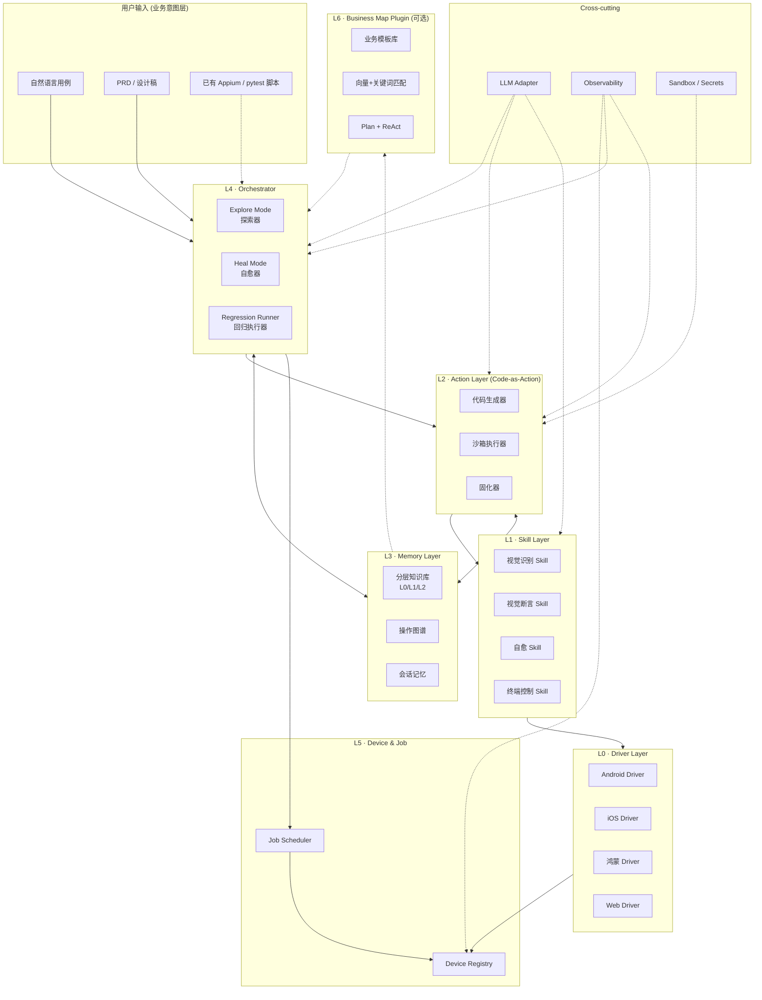

### 2.1 分层一览

| 层 | 名称 | 职责 | 是否调用 LLM |
|---|---|---|---|
| L0 | Driver | 跨端原子操作（tap / swipe / dump_dom）| 否 |
| L1 | Skill | 视觉识别 / 视觉断言 / 自愈 / 终端控制 | 视觉模型，不一定 LLM |
| L2 | Action | Code-as-Action 生成、沙箱执行、固化 | 仅生成时 |
| L3 | Memory | 分层 KB、操作图谱、会话记忆 | 否（被检索） |
| L4 | Orchestrator | 决定走 Explore / Heal / Regression | 仅 Explore + Heal |
| L5 | Device & Job | 设备注册、任务调度、并发管理 | 否 |
| L6 | Business Map | （可选）业务模板 + Plan + ReAct | 仅匹配 + Plan |
| × | LLM Adapter | OpenAI / Anthropic / 本地 / 国产 | — |
| × | Observability | Trace、Cost、日志、Dashboard | 否 |
| × | Sandbox / Secrets | 沙箱执行 + 密钥管理 | 否 |

---

## 3. 分层架构详解

### 3.0 全栈技术速查（按层）

> 详细的库版本、安装方式见各层节，下表是一图速查。

| 层 | 主选型 | 关键 Python 包 / CLI / 服务 |
|---|---|---|
| L0 Driver | Appium 2 | `Appium-Python-Client`, `selenium`, `playwright`, `adbutils`, `pymobiledevice3`；外部进程：appium server v2、adb、WebDriverAgent、HDC |
| L1 Skill | 视觉 + DOM + 规则三层 | `Pillow`, `opencv-python-headless`, `imagehash`, `paddleocr` 或 `rapidocr-onnxruntime`, `numpy`, `scikit-image`, `transformers`, `vllm`, `sentence-transformers`（BGE-M3） |
| L2 Action | Code-as-Action + 轻量沙箱 | `pydantic`, `jinja2`, `ast`(stdlib), `RestrictedPython`（可选），`black`, `psutil`；外部：bubblewrap (`bwrap`)、`prlimit`、macOS `sandbox-exec` |
| L3 Memory | 嵌入式图库 + Qdrant | `kuzu`, `qdrant-client`, `python-frontmatter`, `mistune`, `sqlalchemy`, `redis` |
| L4 Orchestrator | 状态机 + 事件 | `langgraph`（可选）, `pyee`, `structlog`, `tenacity`, `pydantic` |
| L5 Device & Job | **APScheduler + Arq + DB pull queue（不使用 Celery）** | `apscheduler`, `arq`, `redis`, `sqlalchemy`+`alembic`, `fastapi`, `httpx`, `websockets` |
| L6 Business Map（可选） | 模板 + 向量召回 | `pydantic`, `jsonschema`, `networkx`, `jieba`, `spacy`, `qdrant-client` |
| LLM/Vision Adapter | 厂商中立 | `openai`, `anthropic`, `httpx`, `tenacity`, `vllm`, `transformers` |
| Backend API | FastAPI | `fastapi`, `uvicorn[standard]`, `pydantic-settings`, `python-jose[cryptography]` |
| Dashboard | **Ant Design Pro 5（React + TS + Umi 4 + ProComponents）** | `antd`, `@ant-design/pro-components`, `@umijs/max`, `ahooks`, `echarts`, `dayjs`, `swagger-typescript-api` |
| Test Runner | **pytest** | `pytest`, `pytest-xdist`, `pytest-asyncio`, `pytest-html`, `allure-pytest` |
| Observability | OpenTelemetry | `opentelemetry-api`, `opentelemetry-sdk`, `opentelemetry-instrumentation-fastapi`, `prometheus-client` |
| Secrets | 本地优先 | `python-keyring`, `pydantic-settings` |

---

### 3.1 L0 · Driver Layer

**目标**：把 iOS / Android / 鸿蒙 / Web 的差异收敛到一组统一接口。任何上层不该 import 平台特定库。

**统一接口（伪代码）**：

```python
class Driver(Protocol):
    # 生命周期
    def attach(self, device_id: str) -> None: ...
    def detach(self) -> None: ...

    # 原子操作
    def tap(self, x: int, y: int) -> None: ...
    def swipe(self, x1, y1, x2, y2, duration_ms: int) -> None: ...
    def input_text(self, text: str) -> None: ...
    def press_key(self, key: KeyCode) -> None: ...

    # 观察
    def screenshot(self) -> bytes: ...
    def dump_dom(self) -> DomTree: ...
    def get_window_size(self) -> tuple[int, int]: ...

    # App 控制
    def launch_app(self, package_or_bundle_id: str) -> None: ...
    def kill_app(self, package_or_bundle_id: str) -> None: ...
    def get_current_app(self) -> str: ...
```

**实现策略**：

- `AndroidDriver`：基于 `appium-uiautomator2` + `adb`
- `iOSDriver`：基于 WebDriverAgent
- `HarmonyDriver`：基于 HDC
- `WebDriver`：基于 Playwright
- 所有 driver 必须实现完整接口，缺失的能力以 `NotImplementedError` 抛出，由上层降级

**插件化**：driver 通过 entry point（Python `setuptools` 或 plugin manifest）注册，社区可自由贡献新平台（车机、IoT、PC App）。

#### L0 技术栈

| 维度 | 选型 |
|---|---|
| 主语言 | Python 3.11+ |
| 协议层 | **Appium 2.x**（REST/W3C WebDriver Protocol）|
| Appium Server | `appium@next` (npm 全局安装)，启用 `appium-uiautomator2-driver`、`appium-xcuitest-driver`、`appium-plugin-images`（视觉 grounding）|
| Python 客户端 | `Appium-Python-Client>=4.0`（基于 `selenium>=4.20`）|
| Android 底层 | `adbutils>=2.4`（替代 `pure-python-adb`），调用 `adb` CLI |
| iOS 底层 | `pymobiledevice3>=3.0`（替代废弃的 libimobiledevice 系列）+ WebDriverAgent |
| 鸿蒙 | 自封装 `harmony-tool` Python wrapper 调 `hdc` CLI |
| Web | `playwright>=1.42`（headed/headless 都支持），独立于 Appium 体系 |
| 注册机制 | Python entry points（`pyproject.toml` 的 `[project.entry-points."openguirobot.drivers"]`）|

**外部依赖（部署需要）**：

```bash
# Appium 2 server + 三端 driver
npm install -g appium@next
appium driver install uiautomator2
appium driver install xcuitest
appium plugin install images          # 视觉 grounding 用

# Android
sdkmanager "platform-tools"           # 拿 adb

# iOS（macOS 必备）
brew install ios-deploy
# WebDriverAgent 由 appium-xcuitest-driver 编译

# 鸿蒙
# 安装 HarmonyOS SDK，将 hdc 加入 PATH
```

### 3.2 L1 · Skill Layer

**目标**：把一组操作封装成"端无关、AI 友好"的语义动作。

四类基础 skill：

#### 视觉识别 Skill — `Locator`

三层定位（参考小红书）：

```
语义层  →  "把 '搜索' 按钮所在的元素找出来"
DOM 层  →  XPath / accessibility id / 资源 id
视觉层  →  截图 + 多模态模型（用 grounding 模型，如 OmniParser、Qwen-VL）
```

调用流程（伪代码）：

```python
def locate(query: str, dom: DomTree, screenshot: bytes) -> ElementMatch:
    # 1. 先尝试规则层（DOM accessibility id / 文本精确匹配）
    if hit := rule_locator(query, dom):
        return hit
    # 2. 再尝试 DOM + 语义匹配（嵌入向量）
    if hit := semantic_locator(query, dom):
        return hit
    # 3. 兜底走视觉 grounding
    return vision_locator(query, screenshot)
```

#### 视觉断言 Skill — `Assertor`

```python
class AssertResult(TypedDict):
    passed: bool
    confidence: float       # 0..1
    reasoning: str
    evidence: list[bytes]   # 截图证据

def assert_visual(query: str, screenshot: bytes) -> AssertResult: ...
```

通用断言（不依赖业务）：

- 黑屏 / 白屏检测
- 元素错位 / 重叠
- 加载失败提示页
- 错别字检测（OCR + 词典）
- icon 顺序异常

业务断言由用例显式声明。

#### 自愈 Skill — `Healer`

四层防护（直接抄 58 的经验值，见 §7）。

#### 终端控制 Skill — `EnvManager`

- 网络环境（弱网、断网、切换 4G/5G/WiFi）
- 性能指标采集（CPU、内存、FPS）
- 设备状态检查 / 重置（清缓存、重装、重启）
- App 安装 / 升级 / 降级

#### L1 技术栈

| 维度 | 选型 |
|---|---|
| 图像基础处理 | `Pillow>=10.0`（裁剪、合成、format 转换）|
| 计算机视觉 | `opencv-python-headless>=4.9`（SSIM、模板匹配）|
| 感知哈希 | `imagehash>=4.3`（pHash / dHash，截图相似度）|
| OCR（错别字 / 文本识别） | `paddleocr>=2.7` 或 `rapidocr-onnxruntime>=1.3`（无 paddle 重依赖）|
| 多模态视觉模型 | **Qwen2.5-VL-7B**（本地）/ **Qwen-VL-Max**（云，via DashScope）|
| 推理引擎 | `vllm>=0.4`（生产）/ `transformers>=4.40`（开发）|
| 嵌入模型 | `BGE-M3` via `sentence-transformers>=2.7` |
| HTTP 客户端 | `httpx>=0.27`（async）|
| 数值计算 | `numpy`, `scipy`, `scikit-image`（SSIM 备选）|
| 网络弱网模拟 | Android `tc netem` + 自封装；iOS Network Link Conditioner；Web Playwright `route` |
| 性能采集 | `adb shell dumpsys`（Android）、`pymobiledevice3 instruments`（iOS）|

**模型部署形态**：

```yaml
vision:
  default_provider: qwen_vl_local        # 或 qwen_vl_dashscope / openai_vision
  local:
    backend: vllm
    model: Qwen/Qwen2.5-VL-7B-Instruct
    gpu_memory_utilization: 0.85
    served_model_name: qwen-vl
    endpoint: http://localhost:8000/v1
  cloud:
    provider: dashscope
    model: qwen-vl-max
    api_key_env: DASHSCOPE_API_KEY
```

### 3.3 L2 · Action Layer（Code-as-Action）

**目标**：把"自然语言意图"转成"可固化、可调试、零 Token 回归"的代码资产。

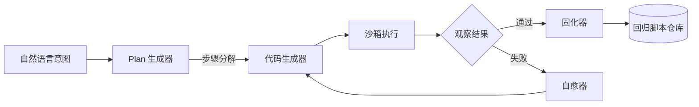

**代码生成器**：

- 输入：自然语言、当前页面截图 + DOM、可用 skill 列表、相关知识库片段
- 输出：一段 Python 代码，调用 skill API，每一步带断言

**沙箱执行（轻量优先，不强依赖 Docker）**：

我们把沙箱分两个 Tier，**默认 Tier 1**：

- **Tier 1（默认 · 轻量）**：操作系统级 namespace + seccomp + 资源限制 + AST 导入白名单
  - Linux：**`bubblewrap` (`bwrap`)** 启动子进程，挂载只读 rootfs、私有 `/tmp`、丢弃多余 namespaces
  - macOS：**`sandbox-exec`** + profile（macOS 内置 sandbox 机制）
  - Windows：`subprocess.Popen` + Job Object + `SetProcessMitigationPolicy`
  - 所有平台：`prlimit` / `setrlimit` 控 CPU、内存、open files；网络白名单通过 `iptables`（Linux）或限定 `socket()` 调用域
- **Tier 2（可选 · 最大隔离）**：gVisor / Docker — 用户在生产里按需启用，**不是默认依赖**

**Python 源码级护栏**：

- 在送进沙箱前用 `ast` 模块解析，比对导入白名单（只允许 `openguirobot.skills.*` / `openguirobot.driver.*` / 标准库子集）
- 禁止 `eval` / `exec` / `compile` / `__import__` / `open` 直接调用
- 可选叠加 **`RestrictedPython`** 做 AST 重写做二道闸

**资源限制 + 超时**：

- 每步骤超时（默认 30s）+ 全流程超时（默认 600s）
- CPU 限 1 核，内存限 512MB（可配置）
- 子进程必须由父进程持有 `psutil` 句柄，超时后递归 SIGKILL

**固化器**：

- 探索成功后，把"被验证过的代码"按用例命名落到 `tests/generated/` 目录
- 同时把过程产物（截图、DOM、决策日志）写入 `evidence/`，供 review
- 用 `black` 自动格式化，确保固化后的代码风格统一可读

#### L2 技术栈

| 维度 | 选型 |
|---|---|
| 代码生成 prompt 模板 | `jinja2>=3.1` |
| Schema / Plan 校验 | `pydantic>=2.6` |
| Python 静态分析 | `ast`（标准库）+ `astor`（pretty-print）|
| AST 级 Python 沙箱（可选） | `RestrictedPython>=7.0` |
| 进程沙箱 · Linux | **`bubblewrap`（bwrap）** CLI |
| 进程沙箱 · macOS | `sandbox-exec` + 自带 profile |
| 进程沙箱 · Windows | Job Object（通过 `pywin32`）|
| 资源限制 | `resource`（标准库 setrlimit）/ `prlimit` CLI / `psutil>=5.9` |
| 代码格式化 | `black>=24.0` + `isort` |
| 重试 / 退避 | `tenacity>=8.2` |

**最小沙箱启动示例（Linux）**：

```python
# openguirobot/action/sandbox.py
import subprocess

BWRAP_ARGS = [
    "bwrap",
    "--ro-bind", "/usr", "/usr",
    "--ro-bind", "/lib", "/lib",
    "--ro-bind", "/lib64", "/lib64",
    "--proc", "/proc",
    "--dev", "/dev",
    "--tmpfs", "/tmp",
    "--unshare-all",
    "--share-net",          # 仅保留网络（要访问 device + 视觉模型）
    "--die-with-parent",
]

def run_in_sandbox(script_path: str, timeout_s: int = 600) -> SandboxResult:
    return subprocess.run(
        [*BWRAP_ARGS, "python3", script_path],
        timeout=timeout_s,
        capture_output=True,
    )
```

### 3.4 L3 · Memory Layer

**目标**：让系统越跑越聪明。详见 §5。

四级记忆：

- **会话记忆（Session）**：单次任务内的步骤上下文，结束即丢
- **单需求记忆（Story）**：一个 PRD / 一个版本周期的探索沉淀
- **跨需求记忆（Domain）**：业务模块级的知识，例如"购物车"模块的所有典型路径
- **跨项目记忆（Org）**：组织级的最佳实践、反模式、终端兼容性历史

存储形态：

- **分层 Markdown 知识库**：`docs/kb/L0|L1|L2/`，跟代码同仓
- **操作图谱**：**KuzuDB（嵌入式图数据库）**+ **Qdrant（向量索引）**
- **会话记忆**：Redis / 进程内 LRU

#### L3 技术栈

| 维度 | 选型 | 说明 |
|---|---|---|
| 图数据库 | **`kuzu>=0.4`** | 嵌入式列存图库，单 `.kuzu` 文件，无独立服务进程；语法接近 Cypher |
| 向量索引 | **`qdrant-client>=1.9`** | Qdrant 本身可嵌入式（`:memory:` / 本地存储）或独立服务，HNSW 性能优 |
| 嵌入模型 | `BGE-M3` via `sentence-transformers` | 中文向量质量高；输出 1024 维 |
| YAML front matter | `python-frontmatter>=1.1` | 解析 KB 文件头 |
| Markdown 解析 | `mistune>=3.0` | 块级解析 + AST，便于按段落入图 |
| 元数据 ORM | `sqlalchemy>=2.0` + Alembic | 默认 SQLite，生产可换 PostgreSQL |
| 会话缓存 | `redis>=5.0` + `cachetools`（进程内 LRU 兜底）| 可选，单机起步可只用 LRU |
| 文件监听（KB 自动入图） | `watchdog>=4.0` | KB 文件变更触发增量入库 |

**Kuzu 嵌入式建图示例**：

```python
import kuzu

db = kuzu.Database("./data/op_graph.kuzu")
conn = kuzu.Connection(db)

conn.execute("""
  CREATE NODE TABLE Page(id STRING, app STRING, route STRING,
                         deeplink STRING, last_verified DATE,
                         PRIMARY KEY(id));
""")
conn.execute("""
  CREATE NODE TABLE Action(id STRING, kind STRING, locator STRING,
                           PRIMARY KEY(id));
""")
conn.execute("""
  CREATE REL TABLE TRIGGERS(FROM Action TO Page, success_rate DOUBLE);
""")
```

**Qdrant 嵌入式检索示例**：

```python
from qdrant_client import QdrantClient

client = QdrantClient(path="./data/qdrant")  # 嵌入式，无需独立 server
client.upsert(
    collection_name="kb_chunks",
    points=[{"id": chunk.id, "vector": embed(chunk.text), "payload": {...}}],
)
```

### 3.5 L4 · Orchestrator

**目标**：三种运行模式的调度中枢。详见 §4。

```python
class Orchestrator:
    def run(self, case: TestCase, ctx: RunContext) -> RunResult:
        if case.has_compiled_script() and ctx.mode == "regression":
            return self._regression(case)
        if ctx.mode == "explore" or not case.has_compiled_script():
            return self._explore(case)
        if ctx.mode == "heal":
            return self._heal(case)
```

#### L4 技术栈

| 维度 | 选型 | 说明 |
|---|---|---|
| 状态机编排（可选） | `langgraph>=0.0.40` | 探索 / 自愈的多步状态机；不强依赖，简单场景可不用 |
| 事件总线 | `pyee>=11.0` | 进程内事件分发（step.start / step.fail 等）|
| 结构化日志 | `structlog>=24.1` | trace_id 贯穿全链路 |
| 重试 / 退避 | `tenacity>=8.2` | 指数退避、条件重试 |
| 类型 / Schema | `pydantic>=2.6` | RunContext / RunResult / Step |
| 异步运行时 | `asyncio`（标准库）+ `anyio>=4.3` | 与 FastAPI / Arq 同栈 |

### 3.6 L5 · Device & Job

#### Device Registry

设备生命周期：

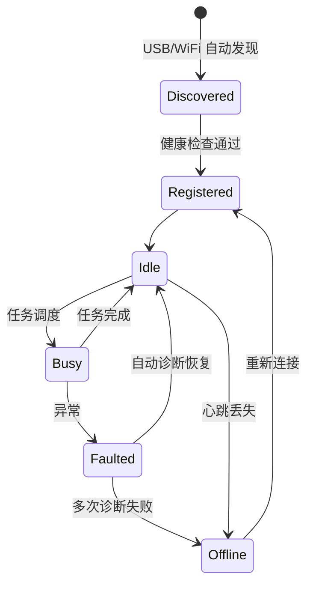

实现要点：

- USB 自动识别（`adb devices`、`ideviceinfo`、`hdc list`）
- WiFi 设备注册：服务端按 IP 维护连接池，断线后由设备主动发起重连（参考 58 的"App 注册到服务器、断线后服务端按 IP 重新请求 App 自动重连"）
- 故障诊断：心跳超时 / 连续失败 → 自动重启 driver / 重启 App / 重启设备 三级降级

#### Job Scheduler

> **明确不使用 Celery。** 我们用三件套替代它，每件各司其职：APScheduler 管定时、Arq 管异步任务、PostgreSQL pull queue 管设备 Agent。

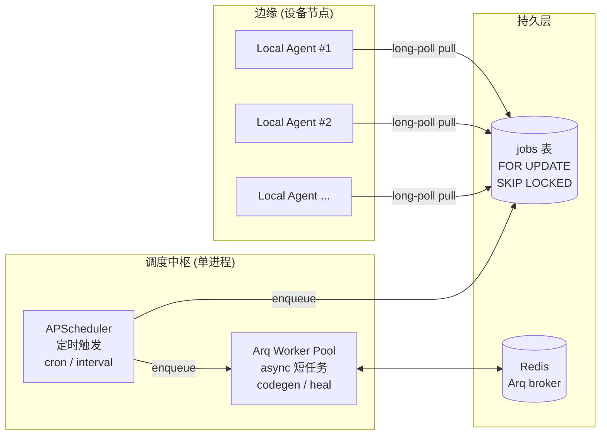

- **调度单元**：`Job = (TestCase, DeviceRequirement, Mode, Priority)`
- **调度策略**：优先级队列 + 设备亲和（同一 case 多次重试尽量同设备）
- **并发**：每设备一个 worker，避免争抢
- **失败重试**：默认 0 次（让自愈器决定），策略可配置
- **Pull-based 设备 Agent**：边缘节点 long-poll `jobs` 表，PostgreSQL 用 `FOR UPDATE SKIP LOCKED` 保证同一 job 只被一个 Agent 拉走

#### L5 技术栈

| 维度 | 选型 | 替代 Celery 的角色 |
|---|---|---|
| **定时任务（cron / interval / date）** | **`apscheduler>=3.10`** | 替代 Celery beat，纯 Python，无 broker 需求 |
| **异步短任务（codegen / heal / 调用 LLM）** | **`arq>=0.25`** + Redis | 替代 Celery worker，async 原生，不阻塞事件循环 |
| **设备 Agent 拉取测试任务** | **PostgreSQL `FOR UPDATE SKIP LOCKED`** + 自封装 long-poll | 替代 Celery 的 push 模型，pull-based 更适合不稳定边缘节点 |
| Broker | `redis>=5.0`（仅 Arq 需要）| Celery 也用 Redis，迁移无新依赖 |
| ORM / 迁移 | `sqlalchemy>=2.0` + `alembic>=1.13` | 任务表、设备表持久化 |
| 设备 Agent 通信 | `fastapi`（注册中心）+ `httpx`（pull）+ `websockets`（实时事件）| 同栈 |
| 心跳 / 健康检查 | APScheduler `interval` 定时 | 周期性扫死节点 |
| App 安装 / 升级 | `adbutils` / `pymobiledevice3` 调用 | 边缘节点能力 |

**任务系统职责划分**：

| 工作类型 | 用谁 | 例子 |
|---|---|---|
| 定时回归 / 巡检 | APScheduler | "每天凌晨 2 点跑 P0 回归" |
| KB stale 扫描 / 图谱维护 | APScheduler | "每周一 9 点扫过期节点" |
| 用户触发的 explore / heal | Arq | "用户提交一句话用例 → enqueue codegen → Arq worker 处理" |
| 设备 Agent 取测试任务 | PostgreSQL pull queue | "Agent 持有 1 台 Pixel 8，pull 适配 Android P0 用例" |

**APScheduler 接入示例**：

```python
from apscheduler.schedulers.asyncio import AsyncIOScheduler
from apscheduler.triggers.cron import CronTrigger

scheduler = AsyncIOScheduler()

# 每天凌晨 2 点跑 P0 全量回归
scheduler.add_job(
    enqueue_p0_regression,
    CronTrigger(hour=2, minute=0),
    id="daily_p0_regression",
)

# 每 5 分钟扫描设备健康
scheduler.add_job(
    scan_device_health,
    "interval", minutes=5,
    id="device_health_scan",
)

scheduler.start()
```

**Arq worker 示例**：

```python
# openguirobot/jobs/worker.py
from arq.connections import RedisSettings

async def codegen_task(ctx, case_id: str):
    case = await load_case(case_id)
    return await orchestrator.explore(case)

class WorkerSettings:
    functions = [codegen_task, heal_task, assert_task]
    redis_settings = RedisSettings(host="localhost")
    max_jobs = 10
```

**Postgres pull queue 示例（设备 Agent）**：

```sql
-- 边缘 Agent 拉取一个匹配自己设备能力的任务
WITH next_job AS (
    SELECT id FROM jobs
    WHERE state = 'queued'
      AND device_match_expr_eval(requirement, $1::jsonb)
    ORDER BY priority DESC, created_at ASC
    FOR UPDATE SKIP LOCKED
    LIMIT 1
)
UPDATE jobs SET state='running', agent_id=$2, started_at=now()
WHERE id = (SELECT id FROM next_job)
RETURNING *;
```

### 3.7 L6 · Business Map Plugin（可选）

**这是高级特性，不是默认路径。**

适用人群：

- 业务流程稳定、有专门人维护图谱
- 大量同类业务的高复用率场景（电商下单、本地生活下单）
- 商业化版本里的差异化能力

提供的能力：

- 业务模板 schema（JSON / YAML）
- 视频 → 图谱抽取管道
- 向量 + 关键词混合匹配
- Plan + ReAct 协同执行
- 模板版本管理 + 灰度发布

接入点：

- 在 Orchestrator 之前插入"模板匹配器"
- 命中模板 → 走 Plan + ReAct 路径
- 未命中 → 回到默认的 Code-as-Action 路径

#### L6 技术栈（可选插件）

| 维度 | 选型 |
|---|---|
| 模板 schema | `pydantic>=2.6` + `jsonschema>=4.21` |
| 链路图建模 | `networkx>=3.2`（用于 Plan 拼接、链路差分） |
| 中文分词 / 参数抽取 | `jieba>=0.42` + `spacy>=3.7`（zh_core_web_trf）|
| 模板向量召回 | `qdrant-client` + BGE-M3（与 L3 复用同一向量库实例）|
| 视频 → 图谱抽取 | `opencv-python` 抽帧 + Qwen-VL grounding 识别操作 + 人工 review 闭环 |
| 模板编辑 UI | 复用 Dashboard（antd-pro 的 ProTable + ProForm + 自定义图谱编辑器）|

---

## 4. 三种运行模式

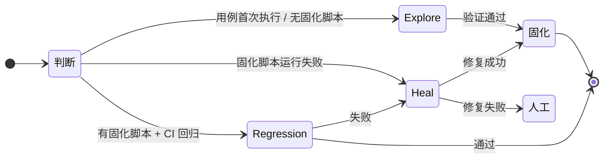

### 4.1 Explore Mode（探索模式）

- 何时进入：用例首次执行、PRD 变更触发、用例显式标记 `@explore`
- LLM 调用：是
- 流程：自然语言意图 → Plan 拆解 → 代码生成 → 沙箱执行 → 验证 → 固化
- 单用例耗时：分钟级，token 消耗：约 1$ 量级
- 输出：可执行 Python 代码 + 证据文件

### 4.2 Heal Mode（自愈模式）

- 何时进入：Regression 失败、用例标记 `@heal-on-fail`
- LLM 调用：是（仅自愈相关步骤）
- 流程：保留原代码骨架 → 识别失败步骤 → 局部生成新代码 → 验证 → 替换
- 关键约束：**不允许改用例意图，只允许局部纠偏**（参考小红书"探索阶段不允许修改用例意图，只允许泛化"）
- 输出：增量 PR（建议人工 review 后合并）

### 4.3 Regression Mode（回归模式）

- 何时进入：CI 触发、定时巡检
- LLM 调用：**否**（除视觉断言 skill 必要时调用视觉模型）
- 流程：直接执行 `tests/generated/` 下的代码
- 单用例成本：~ 0 token，仅算设备时间和视觉断言成本
- 输出：测试报告

---

## 5. 知识层深入设计

### 5.1 分层知识库（Tiered Markdown KB）

```
docs/kb/
├── L0/                      # 摘要层，每文件 ≤ 200 行
│   ├── modules.md           # 全局模块索引
│   ├── glossary.md          # 术语表
│   └── recent_failures.md   # 最近 30 天失败模式
│
├── L1/                      # 概览层，每文件 ≤ 2000 行
│   ├── shopping_cart/
│   │   ├── overview.md
│   │   └── known_issues.md
│   └── search/
│       └── overview.md
│
└── L2/                      # 详情层，按需检索
    ├── shopping_cart/
    │   ├── add_to_cart.md
    │   ├── checkout.md
    │   └── coupon_apply.md
    └── search/
        ├── filter.md
        └── ranking.md
```

**写作规范（强制）**：

每个文件顶部 YAML front matter：

```yaml
---
module: shopping_cart
case: add_to_cart
last_verified: 2026-04-12
verified_versions: [iOS 8.12, Android 8.12]
confidence: high            # high / medium / low / unverified
owners: [@alice, @bob]
deeplinks:
  - "app://product/{id}"
related_skills: [tap, input_text, assert_visual]
tags: [p0, e-commerce]
---
```

正文结构：

```markdown
## 触发路径
## 关键步骤
## 已知异常分支
## 反模式（不要这样做）
## 截图样本（路径）
```

### 5.2 操作图谱（Operation Graph）

**节点类型**：

- `Page`：一个屏幕状态
- `Action`：一个原子操作
- `Path`：一连串 (Page, Action) 形成的链路
- `Anchor`：稳定锚点（用于跨版本对齐）

**边类型**：

- `triggers`：Action 触发的页面跳转
- `prev / next`：链路顺序
- `variant_of`：同一意图的不同实现
- `regressed_from`：失败链路的上游

**关键字段（参考小红书）**：

```typescript
interface PathRef {
  recalledPaths: Path[];        // 图谱已有，最高优先
  suggestedPaths: Path[];       // AI 推导，待验证
  missingKnowledge: string[];   // 图谱空白项
  confidence: { overall: number, perStep: number[] };
}
```

### 5.3 检索流程

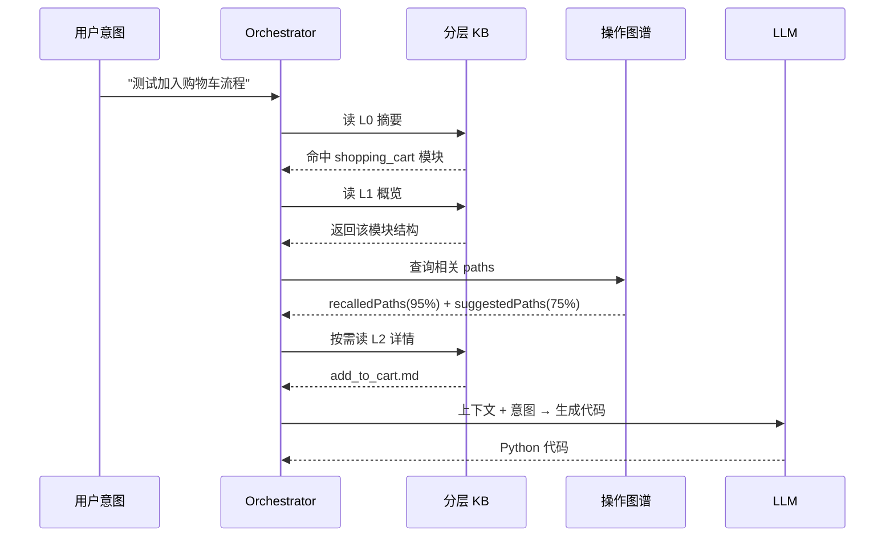

**置信度兜底**：

- `confidence.overall < 60` → 强制人工 review
- `recalledPaths` 与 `suggestedPaths` 矛盾 → 优先 recalled，但记录冲突
- `missingKnowledge` 不为空 → 自动开 ticket 给图谱 owner

### 5.4 反哺与生命周期

**自动反哺**：

- 探索成功 → 固化为 L2 详情 + 图谱 path 节点
- 回归失败 → 标记 path `regressed_from`，触发 `recent_failures.md` 更新
- 自愈成功 → 在 L2 文件加 "已知异常分支" 段落

**自动淘汰**：

- L0 文件 > 200 行 → 自动归档到 L1
- 节点 `last_verified` 超过 90 天且无成功执行记录 → 标记 `stale`
- 标记 `stale` 超过 30 天 → 自动从默认检索剔除（保留可手动恢复）

---

## 6. 跨端 Driver / Skill 体系

### 6.1 三层定位详解

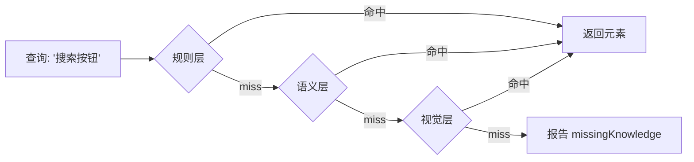

| 层 | 命中率 | 时延 | 成本 |
|---|---|---|---|
| 规则层（DOM accessibility / 资源 id / 精确文本） | 高 | < 50ms | 0 |
| 语义层（DOM 语义嵌入 + 向量召回） | 中 | 100–300ms | 嵌入模型成本（小） |
| 视觉层（多模态 grounding 模型） | 中-高 | 1–3s | 视觉模型成本（中） |

### 6.2 跨端兼容性矩阵

| 能力 | Android | iOS | 鸿蒙 | Web |
|---|---|---|---|---|
| tap / swipe / input | ✓ | ✓ | ✓ | ✓ |
| dump_dom | UiAutomator2 | WDA | HDC | DOM API |
| screenshot | ✓ | ✓ | ✓ | ✓ |
| App 安装 | adb install | ideviceinstaller | hdc install | n/a |
| 弱网 | tc / ATX | Network Link Conditioner | hdc | DevTools |

---

## 7. 自愈与异常处理（四层防护）

直接采用 58 同城的经验值，作为开箱即用的默认策略。

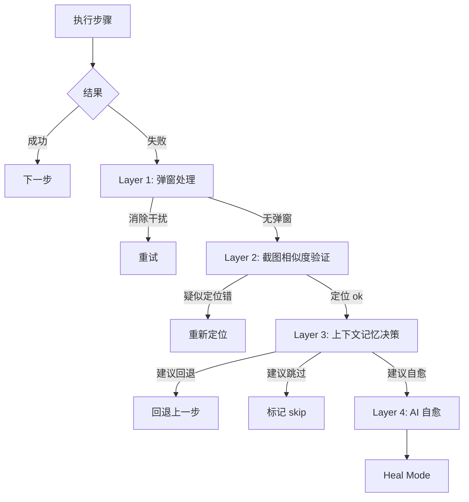

### Layer 1 · 弹窗处理（5 策略）

按顺序尝试，最多递归 3 次：

1. 命中"关闭"按钮文本
2. 命中右上角关闭图标
3. 弹窗外区域点击
4. 系统返回键
5. 向下滑动关闭

### Layer 2 · 截图相似度验证

- 点击操作：执行前后截图相似度应 < 75%（页面跳转）
- 输入操作：相似度应 < 90%（仅键盘弹起）
- 不达标 → 触发重定位

### Layer 3 · 上下文记忆决策

- 同一步骤连续失败 2 次 → 建议回退
- 同一 case 历史成功率 < 50% → 建议回退
- 历史平均重试次数从 2.5 降到 0.8（58 的实测数据，可作为基线）

### Layer 4 · AI 自愈（Heal Mode）

进入 §4.2 的 Heal Mode 流程。

---

## 8. 设备管理与任务调度

### 8.1 设备注册中心

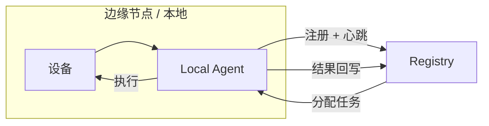

- 边缘节点（Local Agent）持有 driver 实例
- 注册中心维护设备状态（DB + 内存缓存）
- 任务分配通过 pull-based（Agent 主动拉），避免 push 不可达

### 8.2 任务调度

**调度策略**：

- FIFO + 优先级
- 设备亲和（同 case 重试尽量同设备）
- 平台亲和（iOS 用例只投到 iOS 设备）
- 反亲和（同 case 不同变体跨设备并行）

**并发控制**：

- 单设备 1 worker（避免 driver 冲突）
- 同 App 全局并发上限（避免 App 后端被打挂）
- 每个用户 / team quota

---

## 9. LLM 与视觉模型抽象

```python
class LLMClient(Protocol):
    def chat(self, messages: list[Message], **kw) -> Completion: ...
    def embed(self, texts: list[str]) -> list[Vector]: ...
    @property
    def cost_per_1k_input(self) -> float: ...
    @property
    def cost_per_1k_output(self) -> float: ...

class VisionModel(Protocol):
    def describe(self, image: bytes, prompt: str) -> str: ...
    def ground(self, image: bytes, target: str) -> BBox | None: ...
    def diff(self, before: bytes, after: bytes) -> SimilarityScore: ...
```

**默认实现**：

| 模型类型 | 推荐 | 替代 |
|---|---|---|
| 文本 LLM（生成代码） | Claude Sonnet | GPT-5、Qwen3-Coder |
| 视觉模型（断言/grounding） | Qwen2.5-VL | GPT-4o、InternVL |
| 嵌入模型 | BGE-M3 | OpenAI text-embedding-3 |
| 本地代码生成 | Qwen3-Coder（32B+） | DeepSeek-Coder |
| 本地视觉 | Qwen2.5-VL-7B | MiniCPM-V |

**成本控制**：

- 每个 LLM 调用打 trace + cost
- 用例级 budget 限制（超限报警 / 切廉价模型）
- prompt cache 默认开启（避免重复 system prompt）

---

## 10. 安全、沙箱、隐私

### 10.1 沙箱执行（轻量优先）

Code-as-Action 让 LLM 写并执行代码，必须严格沙箱。我们走**轻量路线**，不强依赖 Docker：

| Tier | 技术 | 适用场景 |
|---|---|---|
| Tier 0 · 源码护栏 | `ast` 静态分析 + 导入白名单（必选）+ `RestrictedPython`（可选）| 第一道闸，挡掉 `eval` / `exec` / `__import__` |
| Tier 1 · 默认 · 轻量 OS 沙箱 | Linux: **`bubblewrap` (`bwrap`)**；macOS: `sandbox-exec`；Windows: Job Object | 默认生产配置，毫秒级启动 |
| Tier 2 · 可选 · 强隔离 | gVisor / Docker | 高安全要求场景，用户可启 |

**为什么不默认 Docker**：

- bwrap 是单二进制依赖（Flatpak 也是用的它），启动时间是 Docker 的 1/100
- 边缘节点常常没条件部署 Docker daemon
- 核心仍是 Linux namespace + seccomp，安全等级与 Docker 相当
- 用户可以一行配置切到 Docker，不锁死

**默认 sandbox.yaml**：

```yaml
sandbox:
  tier: bwrap                    # bwrap | sandbox-exec | jobobject | docker | gvisor
  allowed_imports:
    - openguirobot.skills.*
    - openguirobot.driver.*
    - re
    - json
    - typing
    - datetime
    - dataclasses
  banned_builtins:
    - eval
    - exec
    - compile
    - __import__
    - open                       # 文件 IO 走 skill
  allowed_network:
    - "{{ device_ip }}"          # 只能访问目标设备
    - "{{ test_app_backend }}"   # 测试 App 自家后端
    - "{{ vision_model_endpoint }}"
  cpu_limit: 1
  memory_limit_mb: 512
  step_timeout_s: 30
  total_timeout_s: 600
  drop_capabilities: all
  read_only_rootfs: true
```

### 10.2 隐私与脱敏

- 截图入库前自动脱敏（手机号、身份证、人脸打码）
- 知识库 / 图谱默认不存原始截图，只存指纹 + 路径
- 敏感字段白名单 / 黑名单可配置
- 私有化部署模式：所有数据落本地存储 + 本地模型

### 10.3 密钥管理

- LLM API key、设备凭证、App 测试账号统一通过 `Secrets Provider`
- 默认实现：环境变量 + `.env`
- 推荐实现：Vault / AWS Secrets Manager / 阿里云 KMS

---

## 11. 可观测性

### 11.1 数据维度

每次任务记录：

```json
{
  "trace_id": "...",
  "case_id": "...",
  "mode": "explore|heal|regression",
  "device": {...},
  "steps": [
    {
      "id": "step-001",
      "skill": "tap",
      "args": {...},
      "duration_ms": 234,
      "screenshot": "evidence/...",
      "dom_snapshot": "evidence/...",
      "llm_calls": [
        {"model": "claude-sonnet", "tokens_in": 1500, "tokens_out": 200, "cost_usd": 0.005}
      ],
      "result": "success"
    }
  ],
  "verdict": "passed",
  "total_cost_usd": 0.84,
  "total_duration_s": 95
}
```

### 11.2 Dashboard 必备视图

- 任务实时状态
- 设备健康度
- 用例稳定性 Top N（高失败率优先治理）
- LLM 成本趋势 / 按模型 / 按 case
- 知识库腐坏指标（stale 节点占比、missingKnowledge 增长趋势）

### 11.3 接入

默认输出 OpenTelemetry，兼容 Grafana / Datadog / 阿里云 ARMS。

#### 可观测性技术栈

| 维度 | 选型 |
|---|---|
| 标准协议 | OpenTelemetry |
| Python SDK | `opentelemetry-api`, `opentelemetry-sdk` |
| 自动埋点 | `opentelemetry-instrumentation-fastapi`, `opentelemetry-instrumentation-sqlalchemy`, `opentelemetry-instrumentation-redis`, `opentelemetry-instrumentation-httpx` |
| Trace 导出 | `opentelemetry-exporter-otlp`（OTLP 协议，Grafana Tempo / Jaeger / Datadog 都吃）|
| Metric | `prometheus-client>=0.20` + OTel Prometheus exporter |
| 结构化日志 | `structlog>=24.1`（trace_id 注入）|
| CLI 工具的轻量日志 | `loguru>=0.7` |
| 后端可视化（推荐自托管） | Grafana + Tempo（trace）+ Loki（log）+ Prometheus（metric） |

### 11.4 Dashboard 技术栈（前端）

前端用 **Ant Design Pro 5（Umi 4）+ ProComponents** 体系，不走 Next.js 路线。

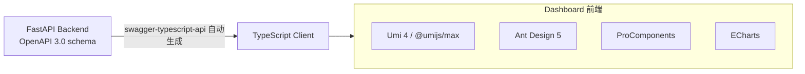

| 维度 | 选型 |
|---|---|
| 语言 | TypeScript 5.x |
| 框架 | React 18 + **Umi 4 (`@umijs/max`)** |
| UI 体系 | **Ant Design 5** + **`@ant-design/pro-components`** |
| 核心组件 | `ProLayout`（中后台壳）、`ProTable`（表格 + 查询表单）、`ProForm`（复杂表单）、`ProDescriptions`（详情页）、`ProCard`、`PageContainer` |
| Hooks 工具 | `ahooks>=3.7`（`useRequest`、`useDebounce`、`useTable` 等） |
| 数据可视化 | `echarts>=5.5` + `echarts-for-react>=3.0` |
| 时间 | `dayjs` |
| HTTP | `umi-request`（Umi 默认）或 `axios` |
| 数据获取 | ahooks `useRequest`（默认）；复杂场景用 `@tanstack/react-query` |
| API 类型同步 | **`swagger-typescript-api`**（一键从 FastAPI 的 OpenAPI 文档生成 TS 客户端，CI 检查类型对齐）|
| 国际化 | Umi 内置 `i18n` |
| 权限 | Umi `access` 插件 + 后端返回 `permissions` 列表 |
| 单测 | `vitest` + `@testing-library/react` |
| E2E | Playwright（同 driver 一致）|
| 包管理 | `pnpm` |

**关键页面建议**：

- 首页（PageContainer + 多 ProCard）：今日跑数、Top N 失败用例、设备健康度
- 设备管理（ProTable）：注册、心跳、状态、远程操作（重启、清缓存）
- 任务中心（ProTable + 详情抽屉 ProDescriptions）：实时任务列表、单任务步骤回放
- 用例管理（ProTable + ProForm）：用例 CRUD、explore/regression 触发
- 知识库浏览（自定义 + ProCard）：L0/L1/L2 树状导航、Markdown 渲染、图谱可视化
- 操作图谱可视化（自定义 + AntV G6 或 ECharts graph）：节点关系、置信度热力
- 成本分析（ECharts）：按模型、按 case、按 team 的 Token / 美金 趋势

---

## 12. 推荐仓库目录结构

```
openguirobot/
├── ARCHITECTURE.md
├── README.md
├── pyproject.toml                     # Python 包定义 + 依赖
├── alembic.ini                        # SQLAlchemy 迁移
├── pnpm-workspace.yaml                # 前端 monorepo 锚（仅 web 用 pnpm）
│
├── openguirobot/                      # 主 Python 包
│   ├── driver/                        # L0 · Appium 2 客户端 + 跨端封装
│   │   ├── base.py
│   │   ├── android.py                 # appium-uiautomator2 + adbutils
│   │   ├── ios.py                     # appium-xcuitest + pymobiledevice3
│   │   ├── harmony.py                 # hdc CLI wrapper
│   │   └── web.py                     # playwright
│   ├── skill/                         # L1 · 视觉/断言/自愈/终端
│   │   ├── locator.py                 # 三层定位
│   │   ├── assertor.py                # 视觉断言 + Qwen-VL
│   │   ├── healer.py                  # 四层防护
│   │   └── env.py                     # 网络 / 性能采集
│   ├── action/                        # L2 · Code-as-Action
│   │   ├── codegen.py                 # jinja2 prompt + LLM
│   │   ├── ast_guard.py               # 导入白名单 + AST 校验
│   │   ├── sandbox.py                 # bwrap / sandbox-exec / job object
│   │   └── compiler.py                # 固化器 + black 格式化
│   ├── memory/                        # L3 · KB + 图谱
│   │   ├── kb.py                      # 分层 Markdown
│   │   ├── graph.py                   # KuzuDB 操作
│   │   ├── vector.py                  # Qdrant 客户端
│   │   └── session.py                 # Redis / LRU
│   ├── orchestrator/                  # L4 · 三种运行模式
│   │   ├── core.py
│   │   ├── explore.py
│   │   ├── heal.py
│   │   └── regression.py
│   ├── device/                        # L5 · 设备
│   │   ├── registry.py                # FastAPI 注册中心
│   │   ├── agent.py                   # 边缘节点 long-poll
│   │   └── health.py
│   ├── jobs/                          # L5 · 任务系统（不是 Celery）
│   │   ├── scheduler.py               # APScheduler 定时
│   │   ├── worker.py                  # Arq async worker
│   │   ├── pull_queue.py              # PostgreSQL FOR UPDATE SKIP LOCKED
│   │   └── tasks.py                   # 任务函数注册表
│   ├── llm/
│   │   ├── base.py                    # LLMClient Protocol
│   │   ├── openai_adapter.py
│   │   ├── anthropic_adapter.py
│   │   ├── dashscope_adapter.py       # 通义系列
│   │   └── local_vllm_adapter.py
│   ├── vision/
│   │   ├── base.py                    # VisionModel Protocol
│   │   ├── qwen_vl.py                 # 本地 / 云端 Qwen-VL
│   │   └── ocr.py                     # PaddleOCR / RapidOCR
│   ├── api/                           # FastAPI 路由
│   │   ├── main.py
│   │   ├── routers/
│   │   └── schemas/                   # pydantic models
│   ├── obs/                           # 可观测性
│   │   ├── tracing.py                 # OTel
│   │   ├── metrics.py                 # Prometheus
│   │   └── logging.py                 # structlog
│   ├── secrets/
│   │   └── keyring_provider.py
│   └── plugins/
│       └── business_map/              # L6 可选插件
│
├── web/                               # Dashboard 前端 (Ant Design Pro)
│   ├── package.json                   # pnpm
│   ├── .umirc.ts                      # Umi 4 配置
│   ├── tsconfig.json
│   ├── src/
│   │   ├── pages/
│   │   │   ├── Dashboard/             # 首页 ProCard 看板
│   │   │   ├── Devices/               # ProTable 设备管理
│   │   │   ├── Jobs/                  # ProTable 任务中心
│   │   │   ├── Cases/                 # ProTable + ProForm 用例管理
│   │   │   ├── Knowledge/             # 分层 KB 浏览
│   │   │   ├── Graph/                 # 操作图谱可视化（AntV G6）
│   │   │   └── Cost/                  # ECharts 成本分析
│   │   ├── components/
│   │   ├── services/                  # swagger-typescript-api 生成
│   │   ├── models/                    # @umijs/max 状态
│   │   └── access.ts                  # 权限
│   └── mock/
│
├── deploy/
│   ├── compose/                       # docker-compose（用户可选）
│   ├── k8s/                           # helm chart（生产）
│   └── sandbox/
│       ├── bwrap.profile              # bubblewrap 默认 profile
│       └── sandbox-exec.sb            # macOS sandbox-exec profile
│
├── tests/
│   ├── unit/
│   ├── integration/
│   └── generated/                     # 用户工程里固化的代码会落到这里
│
├── docs/
│   ├── ARCHITECTURE.md
│   ├── API.md
│   ├── CONTRIBUTING.md
│   ├── kb/                            # 默认知识库样例
│   │   ├── L0/
│   │   ├── L1/
│   │   └── L2/
│   └── examples/
│
└── examples/
    ├── e_commerce/
    ├── social_app/
    └── migration_from_appium/
```

---

## 13. 技术选型建议

> 本节为**最终选型**。与社区常见组合的差异在于：沙箱走轻量路线（不强依赖 Docker）、定时任务**不使用 Celery**、Dashboard 走 antd-pro + ProComponents 而非 Next.js。

### 13.1 主选型表

| 领域 | 选型 | 替代 | 理由 |
|---|---|---|---|
| 主语言 | **Python 3.11+** | TypeScript | 测试生态主战场，LLM 工具链成熟 |
| 后端 Web 框架 | **FastAPI 0.110+** + uvicorn | Starlette + 自封装 | OpenAPI 原生、异步、生态完善 |
| Driver 协议 | **Appium 2.x** | 自研 + 直连 ADB / WDA | 节省 driver 维护成本，Appium 2 已支持插件机制 |
| 沙箱（默认轻量） | **bubblewrap (bwrap)** + AST 导入白名单 + `prlimit`/`setrlimit` | macOS 用 `sandbox-exec`；Windows 用 Job Object | 单二进制依赖、毫秒级启动、无 Docker 体积负担 |
| 沙箱（最大隔离，可选） | gVisor / Docker | Firecracker | 用户可在生产里按需启用，不是默认依赖 |
| Python 代码静态加固 | **`ast` 解析 + 导入白名单**；可选叠加 `RestrictedPython` | PyPy sandbox（已停） | 源码级第一道闸 |
| 图数据库 | **KuzuDB**（嵌入式）| NebulaGraph（分布式）| 单文件起步，零运维；规模化再迁 |
| 向量索引 | **Qdrant** | pgvector / Milvus | 单二进制可跑、HNSW 性能好、Python 客户端成熟 |
| 元数据库 | **SQLite**（默认）/ **PostgreSQL**（生产）| MySQL | 起步零成本，规模化平滑迁移 |
| 缓存 / 会话记忆 | **Redis 7.x** | DragonflyDB | broker + cache 一鱼两吃 |
| 定时任务（cron） | **APScheduler 3.10+** | rocketry, schedule | **不使用 Celery**；APScheduler 嵌入式、无 broker 需求 |
| 异步任务执行 | **Arq 0.25+**（async + Redis）| Dramatiq, RQ, Huey | **不使用 Celery**；Arq 全 async，与 FastAPI 同栈 |
| 设备 Agent 拉式队列 | **PostgreSQL `FOR UPDATE SKIP LOCKED`**（推荐）/ Redis Stream | 自封装 | pull-based 模型适合不稳定的设备节点 |
| 任务持久化 | SQLAlchemy 2.0 + Alembic | Tortoise ORM | 业界标准、迁移工具成熟 |
| 测试运行器 | **pytest 8.x**（+ pytest-xdist + pytest-asyncio + allure-pytest）| unittest | 用户继续使用熟悉工具；并发与报告生态完善 |
| 多模态推理 | **Qwen-VL 系列**（Qwen2.5-VL-7B 本地 / Qwen-VL-Max 云端）via **vLLM** | InternVL, MiniCPM-V | 中文场景准确率高、推理性能好；云端可走 DashScope |
| 文本 LLM | Claude Sonnet（云）/ Qwen3-Coder（本地）| GPT-5、DeepSeek-Coder | 厂商中立适配器抽象 |
| 嵌入模型 | **BGE-M3** | OpenAI text-embedding-3 | 中文向量质量高，本地可跑 |
| OCR | **PaddleOCR** 或 **rapidocr-onnxruntime** | Tesseract | 中文识别强、ONNX 版无 PaddlePaddle 重依赖 |
| 图像处理 / 相似度 | Pillow + opencv-python-headless + imagehash | scikit-image | 截图差异、感知哈希 |
| Dashboard 前端 | **React 18 + TypeScript + Ant Design Pro 5（Umi 4 + ProComponents）** | Next.js + shadcn/ui | 企业中后台开箱即用、ProTable/ProForm 极大节省工程量 |
| 数据可视化 | **ECharts 5 + echarts-for-react** | Recharts, AntV | 与 antd 视觉风格一致、性能好 |
| API → 前端类型同步 | **swagger-typescript-api** | Orval | 一行命令从 OpenAPI 生成 TS 客户端 |
| 可观测性 | **OpenTelemetry Python SDK** + Prometheus client | Datadog APM 直采 | 标准协议，导出端可换 |
| 结构化日志 | **structlog** + `loguru`（CLI 工具）| 标准 logging | 结构化、可查询 |
| 密钥管理 | **python-keyring** + pydantic-settings | HashiCorp Vault | 默认本地 keyring，生产可换 |

---

## 14. 落地路线图

### v0.1 · "能跑通"（4–6 周）

- L0 Driver：Android + iOS（基于 Appium）
- L1 Skill：Locator（规则 + 视觉两层）+ 简易 Assertor
- L2 Action：Code-as-Action 最小闭环（生成 → 沙箱 → 固化）
- 单设备 + 单进程
- 一个 demo（电商搜索 → 加购 → 下单）
- LLM：仅 OpenAI / Anthropic 适配器

**成功标志**：用户能用一句话跑出一个 demo 并固化成 Python 代码。

### v0.2 · "稳"（再 4 周）

- 弹窗 5 策略 + 截图相似度自愈
- 异步断言 Agent
- 仓库内分层知识库 L0/L1
- pytest 集成
- 视觉模型适配（Qwen-VL 本地 + GPT-4o 云）

**成功标志**：连续 50 个回归用例稳定性 > 95%。

### v0.3 · "可规模"（再 4 周）

- 操作图谱 + 路径引导 + 置信度
- L2 知识库 + 自动反哺
- 设备注册中心 + 任务调度
- 多设备并发
- 鸿蒙 driver

**成功标志**：单台调度机管理 20+ 设备稳定运行。

### v0.4 · "企业试点"（再 6 周）

- Heal Mode + 自动 PR
- Web Dashboard
- 多租户 + 权限
- 离线 / 私有化部署模板
- Observability（OpenTelemetry）

### v1.0 · "生产可用"

- 完整文档（含贡献者指南、企业部署指南）
- 模型适配（国产、本地）全面覆盖
- 安全审计报告
- LTS 分支

### v1.x · "高级特性"

- 业务地图插件（L6）
- 视频 → 操作图谱抽取
- IDE 插件（VSCode + JetBrains）
- 商业版差异化能力

---

## 15. 渐进式迁移路径

为已有 Appium / Selenium 用户提供平滑过渡：

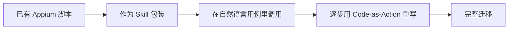

具体操作：

1. **第一步**：把已有 Appium 脚本拆成函数，注册为 Skill
2. **第二步**：在新用例里以自然语言调用（"先调用 legacy_login，再做新流程"）
3. **第三步**：单个用例完整迁移到 Code-as-Action
4. **第四步**：旧脚本归档

---

## 16. 设计权衡与已知风险

### 16.1 主要权衡

| 选择 | 替代方案 | 我们的选择 | 代价 |
|---|---|---|---|
| Code-as-Action | ToolCall | Code-as-Action | 依赖模型 coding 能力 |
| Markdown KB | 结构化图谱（业务地图） | Markdown 默认，图谱可选 | 治理成本（需要规范） |
| 跨端三层定位 | 单一 DOM 定位 | 三层降级 | 视觉层成本和延迟 |
| 单语言主仓 | 多语言（边缘 Go / 主控 Python） | 单 Python | 性能上限（可后期分拆） |

### 16.2 已知风险

- **R1：模型 coding 能力波动**——不同 LLM 生成的代码质量差异大。缓解：维护一组"金标用例"，每次主推模型升级先过一遍。
- **R2：知识库腐坏**——如果团队不维护，效果会衰减。缓解：自动 stale 检测 + 强制 owner 制度。
- **R3：沙箱逃逸风险**——LLM 生成恶意代码。缓解：沙箱 + 允许列表 + 静态扫描三层防护。
- **R4：视觉模型成本**——大规模回归时视觉断言累计成本可能超预算。缓解：默认只在差异检测时启用、本地模型作为兜底。
- **R5：长尾业务场景覆盖不足**——纯 Code-as-Action 在罕见路径上易跑偏。缓解：用 §3.7 的业务地图插件作为高级补充。

---

## 17. 术语表

- **Code-as-Action**：让 LLM 直接生成可执行代码作为动作表达，区别于 ToolCall 模式。
- **固化 / Compile**：把探索成功的代码持久化为回归脚本的过程。
- **路径引导（Path Guidance）**：通过操作图谱预先注入候选路径以约束 LLM 探索方向。
- **置信度（Confidence）**：每个路径 / 节点的可信程度，决定是否需要人工 review。
- **Recall Path / Suggested Path / Missing Knowledge**：操作图谱返回的三类信息（已知精确路径 / AI 推导路径 / 图谱空白）。
- **Skill**：跨端的语义动作封装，是 LLM 可以调用的最小单元。
- **Driver**：单端原子操作的接口实现层。

---

## 18. 参考来源

本文档的设计思想综合自以下分享与开源工作：

- 张亦驰 ·《小红书 GUI Agent 在智能化测试中的工程落地实践》（QCon 北京 2026）
- 仲思宇 ·《58 同城基于业务流程管理的客户端 AI Agent 智能化测试实践》
- Appium、Playwright、WebDriverAgent、HDC 项目
- OmniParser、Qwen-VL、InternVL 等多模态视觉模型项目
- LangChain、LlamaIndex、AutoGen 等 Agent 框架的工程经验

---

## 附录 A · 一份用例长什么样

`tests/cases/shopping_cart/add_to_cart.case.yaml`：

```yaml
case_id: e_commerce.shopping_cart.add_to_cart
title: 加入购物车基础流程
intent: |
  启动 App，搜索商品 "无线耳机"，从结果中选择第一个，
  进入详情页后选择默认规格，点击加入购物车，
  断言购物车角标 +1。

platforms: [android, ios]
priority: p0
mode: explore         # 首次执行用 explore，后续 CI 自动切到 regression
budget_usd: 1.5
timeout_s: 600

env:
  network: wifi
  language: zh-CN
  test_account: ${SECRET:e_com_account_a}

assertions:
  - kind: visual
    desc: 购物车角标数字增加 1
  - kind: api
    desc: 后端订单服务收到 add_to_cart 事件
    endpoint: ${API_BACKEND}/cart/recent
```

## 附录 B · 一份固化后的脚本长什么样

`tests/generated/shopping_cart/add_to_cart.py`：

```python
"""
Auto-generated from case: e_commerce.shopping_cart.add_to_cart
Generated at: 2026-04-15 by openguirobot v0.3.1
DO NOT edit by hand. Re-run heal mode to regenerate.
"""

from openguirobot.runtime import session, locate, tap, input_text, assert_visual

def test_add_to_cart(driver):
    with session(driver, case_id="e_commerce.shopping_cart.add_to_cart") as s:
        s.launch_app("com.example.shop")

        s.tap(locate("搜索入口"))
        s.input_text("无线耳机")
        s.press_key("Enter")

        first = locate("搜索结果列表中第一个商品卡片")
        s.tap(first)

        s.tap(locate("加入购物车按钮"))

        assert_visual("购物车图标右上角红点显示 1", timeout_s=5)
```

## 附录 C · 完整 pyproject.toml 依赖清单

> 直接 copy 即可起项目骨架。版本号是写文档时的最新稳定版，按需更新。

```toml
[project]
name = "openguirobot"
version = "0.1.0"
requires-python = ">=3.11"
description = "Open-source enterprise-grade GUI Agent test platform"

dependencies = [
    # ----- L0 Driver -----
    "Appium-Python-Client>=4.0",
    "selenium>=4.20",
    "playwright>=1.42",
    "adbutils>=2.4",
    "pymobiledevice3>=3.0",

    # ----- L1 Skill / Vision / OCR -----
    "Pillow>=10.0",
    "opencv-python-headless>=4.9",
    "imagehash>=4.3",
    "rapidocr-onnxruntime>=1.3",   # 默认；如需中文极致准确度切 paddleocr
    "numpy>=1.26",
    "scipy>=1.13",
    "scikit-image>=0.23",
    "transformers>=4.40",
    "vllm>=0.4",                    # 可作为 extras，不强制安装
    "sentence-transformers>=2.7",   # BGE-M3

    # ----- L2 Action / Sandbox -----
    "pydantic>=2.6",
    "pydantic-settings>=2.2",
    "jinja2>=3.1",
    "RestrictedPython>=7.0",        # 可选，AST 二次护栏
    "black>=24.0",
    "psutil>=5.9",
    "tenacity>=8.2",

    # ----- L3 Memory -----
    "kuzu>=0.4",                    # 嵌入式图库
    "qdrant-client>=1.9",           # 可嵌入式或独立服务
    "python-frontmatter>=1.1",
    "mistune>=3.0",
    "sqlalchemy>=2.0",
    "alembic>=1.13",
    "redis>=5.0",
    "cachetools>=5.3",
    "watchdog>=4.0",

    # ----- L4 Orchestrator -----
    "pyee>=11.0",
    "structlog>=24.1",
    "anyio>=4.3",
    # "langgraph>=0.0.40",          # 可选

    # ----- L5 Device & Job (NO CELERY) -----
    "apscheduler>=3.10",            # cron / interval 定时任务
    "arq>=0.25",                    # async 任务队列（替代 Celery worker）
    "fastapi>=0.110",
    "uvicorn[standard]>=0.27",
    "httpx>=0.27",
    "websockets>=12.0",

    # ----- LLM Adapters -----
    "openai>=1.20",
    "anthropic>=0.25",
    "dashscope>=1.17",              # 通义千问 / Qwen-VL 云端

    # ----- Observability -----
    "opentelemetry-api>=1.24",
    "opentelemetry-sdk>=1.24",
    "opentelemetry-instrumentation-fastapi>=0.45b0",
    "opentelemetry-instrumentation-sqlalchemy>=0.45b0",
    "opentelemetry-instrumentation-redis>=0.45b0",
    "opentelemetry-instrumentation-httpx>=0.45b0",
    "opentelemetry-exporter-otlp>=1.24",
    "prometheus-client>=0.20",
    "loguru>=0.7",

    # ----- Secrets -----
    "keyring>=24.3",

    # ----- Misc -----
    "python-jose[cryptography]>=3.3",
    "rich>=13.7",                   # CLI 美化
]

[project.optional-dependencies]
test = [
    "pytest>=8.0",
    "pytest-xdist>=3.5",
    "pytest-asyncio>=0.23",
    "pytest-html>=4.1",
    "allure-pytest>=2.13",
    "respx>=0.20",                  # httpx mock
]
nlp = [
    "jieba>=0.42",
    "spacy>=3.7",
]
business_map = [
    "jsonschema>=4.21",
    "networkx>=3.2",
]
local-vision = [
    "vllm>=0.4",
    "torch>=2.2",
]
postgres = [
    "psycopg[binary]>=3.1",
]

[project.entry-points."openguirobot.drivers"]
android = "openguirobot.driver.android:AndroidDriver"
ios     = "openguirobot.driver.ios:IOSDriver"
harmony = "openguirobot.driver.harmony:HarmonyDriver"
web     = "openguirobot.driver.web:WebDriver"

[project.scripts]
ogr = "openguirobot.cli:main"
```

## 附录 D · Dashboard package.json 依赖清单

> `web/package.json`，基于 Ant Design Pro 5（Umi 4）。

```json
{
  "name": "openguirobot-web",
  "private": true,
  "scripts": {
    "dev": "max dev",
    "build": "max build",
    "format": "prettier --write .",
    "test": "vitest",
    "gen:api": "swagger-typescript-api -p http://localhost:8000/openapi.json -o ./src/services -n api.ts --modular"
  },
  "dependencies": {
    "@ant-design/pro-components": "^2.7.0",
    "@umijs/max": "^4.1.0",
    "antd": "^5.16.0",
    "ahooks": "^3.7.0",
    "echarts": "^5.5.0",
    "echarts-for-react": "^3.0.2",
    "@antv/g6": "^5.0.0",
    "dayjs": "^1.11.0",
    "react": "^18.2.0",
    "react-dom": "^18.2.0",
    "react-markdown": "^9.0.0"
  },
  "devDependencies": {
    "typescript": "^5.4.0",
    "@types/react": "^18.2.0",
    "@types/react-dom": "^18.2.0",
    "@testing-library/react": "^14.0.0",
    "vitest": "^1.4.0",
    "prettier": "^3.2.0",
    "swagger-typescript-api": "^13.0.0"
  },
  "packageManager": "pnpm@9.0.0"
}
```

## 附录 E · 不同环境的运行时配置示例

### 开发机（macOS / Linux 单机起步）

- 沙箱：bwrap（Linux）/ sandbox-exec（macOS）
- 图库：KuzuDB 嵌入式（`./data/op_graph.kuzu`）
- 向量索引：Qdrant 嵌入式（`./data/qdrant`）
- 元数据：SQLite（`./data/openguirobot.db`）
- Redis：本地 6379
- LLM：云端 Claude / Qwen-VL-Max 通过 API key
- 部署形态：`uvicorn openguirobot.api.main:app` 单进程

### 内网生产（中等规模，10–50 设备）

- 沙箱：bwrap
- 图库：KuzuDB 嵌入式或迁移到 NebulaGraph
- 向量索引：Qdrant 独立服务（Docker / 物理机）
- 元数据：PostgreSQL
- Redis：独立 Redis 实例
- LLM：本地 vLLM（Qwen2.5-VL-7B + Qwen3-Coder-32B）
- 部署形态：FastAPI（Gunicorn + Uvicorn workers） + APScheduler 单实例 + Arq workers + 多个边缘 Local Agent
- 编排：docker-compose 或 K8s Helm chart

### 高合规离线（私有化版本）

- 沙箱：bwrap + gVisor 双层
- 全部本地模型（Qwen-VL + BGE-M3 + Qwen3-Coder）
- 截图脱敏管线强制开启
- 知识库 + 图谱不出内网

