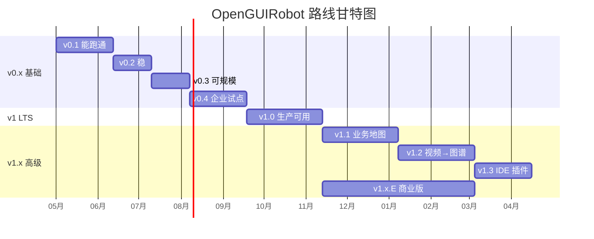
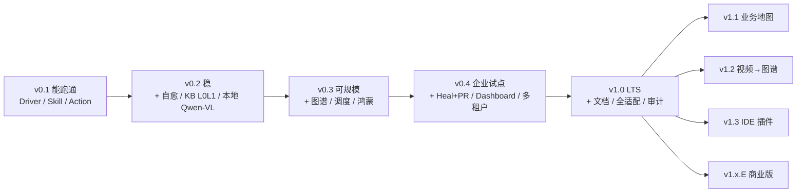

# OpenGUIRobot · 落地路线图索引

> 本目录把 [`ARCHITECTURE.md`](../../ARCHITECTURE.md) §14 中的版本路线，按"每个版本一组（PRD + 技术文档）"展开。
> 每个版本独立排期、独立验收、独立发布。下一个版本依赖前一个版本的能力，但文档之间不写实现细节，只引用上游文档。

---

## 版本一览

| 版本 | 主题 | 周期 | 关键产出 | 文档 |
|---|---|---|---|---|
| v0.1 | 能跑通 | 4–6 周 | 单设备 demo + Code-as-Action 闭环 | [PRD](./v0.1/PRD.md) · [Tech Spec](./v0.1/TECH-SPEC.md) |
| v0.2 | 稳 | 再 4 周 | 四层自愈 + 异步断言 + KB L0/L1 + 本地 Qwen-VL | [PRD](./v0.2/PRD.md) · [Tech Spec](./v0.2/TECH-SPEC.md) |
| v0.3 | 可规模 | 再 4 周 | 操作图谱 + 设备注册 + 任务调度 + 鸿蒙 | [PRD](./v0.3/PRD.md) · [Tech Spec](./v0.3/TECH-SPEC.md) |
| v0.4 | 企业试点 | 再 6 周 | Heal+PR / Dashboard / 多租户 / OTel | [PRD](./v0.4/PRD.md) · [Tech Spec](./v0.4/TECH-SPEC.md) |
| v1.0 | 生产可用（LTS） | 6–8 周 | 文档完整 + 全量适配 + 安全审计 + LTS | [PRD](./v1.0/PRD.md) · [Tech Spec](./v1.0/TECH-SPEC.md) |
| v1.x | 高级特性 | 按季度 | 业务地图 / 视频→图谱 / IDE 插件 / 商业版 | [PRD](./v1.x/PRD.md) · [Tech Spec](./v1.x/TECH-SPEC.md) |

---

## 总体里程碑（合并）

> 注：v1.x.E 与 v1.1–v1.3 并行，因团队不同。

---

## 版本之间的能力继承

---

## 文档约定

每个版本目录包含两份文档：

| 文件 | 关注点 | 主要读者 |
|---|---|---|
| `PRD.md` | 用户价值、功能范围、验收标准、时间安排 | 产品 / QA / 客户 / 决策层 |
| `TECH-SPEC.md` | 模块拆分、关键技术决策、接口数据模型、风险、WBS | 工程团队 / 贡献者 |

公共内容（架构、技术栈、目录结构、跨版本约定）一律放在仓库根 [`ARCHITECTURE.md`](../../ARCHITECTURE.md)，本路线图文档**只引用，不复述**。

---

## 文档维护规则

1. **版本进入实施前**：把 PRD / Tech Spec 上 review；签字后冻结 scope
2. **版本实施期间**：scope 变更必须更新对应文档 + CHANGELOG，附决策原因
3. **版本完成后**：在文档顶部加一行"已交付：vX.Y.Z（YYYY-MM-DD）"
4. **跨版本影响的决策**：写为 ADR，落到 `docs/adr/`，并在涉及的版本文档中引用
5. **每份 PRD / Tech Spec 必须有 owner**（在文件元数据写明）

---

## 当前状态

| 版本 | 状态 | 备注 |
|---|---|---|
| v0.1 | Draft（PRD + Tech Spec） | — |
| v0.2 | Draft（PRD + Tech Spec） | — |
| v0.3 | Draft（PRD + Tech Spec） | — |
| v0.4 | Draft（PRD + Tech Spec） | — |
| v1.0 | Draft（PRD + Tech Spec） | — |
| v1.x | Draft（路线图层） | 子版本进入实施前再细化 |

---

## 推荐阅读顺序

1. 先读仓库根 [`ARCHITECTURE.md`](../../ARCHITECTURE.md) 了解整体架构
2. 顺序读 v0.1 → v0.2 → v0.3 → v0.4 → v1.0 PRD 建立产品轮廓
3. 工程同学再补读对应 TECH-SPEC
4. v1.x 是路线图，只在评估远期能力时阅读
