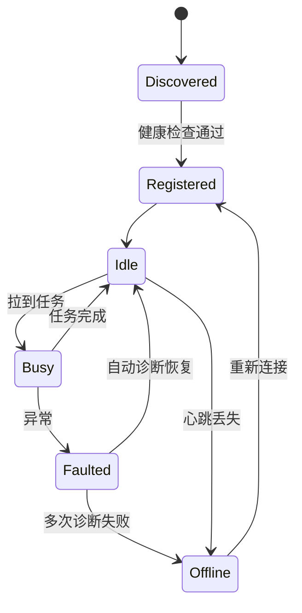

# OpenGUIRobot · v0.3 技术文档

> 配合 [`PRD.md`](./PRD.md)。架构总览见 [`ARCHITECTURE.md`](../../../ARCHITECTURE.md)。

---

## 1. 技术目标

- 让 LLM 探索"由图谱引导"，减少跑偏
- 把"设备 + 任务"做成可水平扩展的服务
- 鸿蒙加入跨端能力矩阵
- KB / 图谱形成自动反哺闭环

---

## 2. 模块清单与工作分解

| 模块 | 包 | 工作 | 估时（人天） |
|---|---|---|---|
| Graph Schema | `openguirobot.memory.graph` | KuzuDB 建表、Cypher 接口 | 4 |
| Vector Index | `openguirobot.memory.vector` | Qdrant 嵌入 + 增量更新 | 3 |
| Path Recall API | `openguirobot.memory.recall` | recalled / suggested / missing / confidence | 5 |
| KB Auto-write | `openguirobot.memory.kb_writer` | 探索成功 → L2 KB 草稿生成 | 4 |
| Device Registry | `openguirobot.device.registry` | FastAPI 服务 + 心跳 + 状态机 | 5 |
| Local Agent | `openguirobot.device.agent` | USB/WiFi 发现 + long-poll | 5 |
| Job Scheduler | `openguirobot.jobs.scheduler` | APScheduler + 任务函数注册 | 3 |
| Arq Worker | `openguirobot.jobs.worker` | 异步任务 + Redis broker | 3 |
| Pull Queue | `openguirobot.jobs.pull_queue` | PostgreSQL skip locked | 4 |
| 调度策略 | `openguirobot.jobs.policy` | 优先级 + 亲和 + 反亲和 | 3 |
| Harmony Driver | `openguirobot.driver.harmony` | HDC wrapper + Capabilities | 5 |
| KB lint v2 | `openguirobot.memory.kb_lint` | 增量 + stats | 2 |
| 文档 | `docs/` | MEMORY / DEVICE-REGISTRY / SCHEDULER / HARMONY | 3 |

合计：约 49 人天。

---

## 3. 关键技术决策

### 3.1 KuzuDB 嵌入式 + 单进程 writer

KuzuDB 嵌入式不支持多进程写。设计上：

- **Writer 服务**：单实例，负责所有图谱写操作，对外暴露 gRPC / HTTP
- **Reader**：任意进程可只读 attach 同一 `.kuzu` 文件
- 后续真规模化（v1.x）可平滑迁到 NebulaGraph

### 3.2 路径召回三段式

```
意图 query
    ├─ Qdrant 向量召回 top-K paths（语义近似）
    ├─ Kuzu 图遍历沿候选 path 抓子图（结构验证）
    └─ Rerank：综合 confidence、success_rate、最近验证时间
```

返回结构：

```python
class PathRef(BaseModel):
    recalledPaths: list[Path]        # 高置信度 + 最近验证过
    suggestedPaths: list[Path]       # AI 推导，标 unverified
    missingKnowledge: list[str]      # 图谱空白点
    confidence: ConfidenceBreakdown
```

### 3.3 Pull queue 而非 Push queue

边缘节点（设备 Agent）网络环境不稳定，push 模型容易丢任务。改用 pull：

```sql
-- Agent 拉一个适配自己设备的任务
WITH next_job AS (
    SELECT id FROM jobs
    WHERE state = 'queued'
      AND (requirement -> 'platform') ?| array[$2::text]
      AND (requirement -> 'min_api') <= $3::int
    ORDER BY priority DESC, created_at ASC
    FOR UPDATE SKIP LOCKED
    LIMIT 1
)
UPDATE jobs SET state='running', agent_id=$1, started_at=now()
WHERE id = (SELECT id FROM next_job)
RETURNING *;
```

### 3.4 三种任务系统职责严格切分

| 系统 | 角色 | 例子 |
|---|---|---|
| APScheduler | 定时触发 | "每天 02:00 跑 P0 全量" |
| Arq | 异步短任务 | LLM codegen / 视觉断言 / KB 摘要生成 |
| Pull Queue | 设备级任务 | "Pixel 8 拉到 add_to_cart 这个 job" |

### 3.5 鸿蒙 driver 不走 Appium

鸿蒙 Next 没有完善的 Appium driver，自封装 HDC CLI 更可控：

```python
class HarmonyDriver(Driver):
    def __init__(self, udid: str):
        self._hdc = HdcCli(udid)

    def tap(self, x: int, y: int) -> None:
        self._hdc.shell(f"uitest uiInput click {x} {y}")
```

---

## 4. 接口与数据模型

### 4.1 Graph Schema（KuzuDB Cypher）

```cypher
CREATE NODE TABLE Page(
  id STRING, app STRING, route STRING,
  deeplink STRING, last_verified DATE,
  fingerprint STRING,
  PRIMARY KEY(id)
);

CREATE NODE TABLE Action(
  id STRING, kind STRING, locator STRING,
  expected STRING,
  PRIMARY KEY(id)
);

CREATE NODE TABLE Path(
  id STRING, intent STRING,
  success_rate DOUBLE, last_run TIMESTAMP,
  confidence DOUBLE, stale BOOLEAN,
  PRIMARY KEY(id)
);

CREATE REL TABLE TRIGGERS(FROM Action TO Page,
  success_rate DOUBLE, last_seen TIMESTAMP);

CREATE REL TABLE STEP_OF(FROM Action TO Path,
  step_index INT64);

CREATE REL TABLE VARIANT_OF(FROM Path TO Path,
  platform STRING);

CREATE REL TABLE REGRESSED_FROM(FROM Path TO Path,
  reason STRING, since TIMESTAMP);
```

### 4.2 Job 表（PostgreSQL）

```sql
CREATE TABLE jobs (
    id           BIGSERIAL PRIMARY KEY,
    case_id      TEXT NOT NULL,
    mode         TEXT NOT NULL,                -- explore | replay | heal
    requirement  JSONB NOT NULL,               -- platform / min_api / device_tags
    priority     INT  NOT NULL DEFAULT 0,
    state        TEXT NOT NULL DEFAULT 'queued',
    agent_id     TEXT,
    started_at   TIMESTAMPTZ,
    finished_at  TIMESTAMPTZ,
    result       JSONB,
    created_at   TIMESTAMPTZ DEFAULT now()
);
CREATE INDEX ix_jobs_state_priority ON jobs (state, priority DESC, created_at);
```

### 4.3 Device 状态机



### 4.4 Local Agent 流程

```python
async def agent_loop(agent_id: str, devices: list[DeviceInfo]):
    await registry.register(agent_id, devices)
    while True:
        await registry.heartbeat(agent_id)
        for dev in devices:
            job = await pull_queue.try_pull(agent_id, dev.requirement_match)
            if job:
                asyncio.create_task(execute(job, dev))
        await asyncio.sleep(2)
```

### 4.5 KB 自动反哺接口

```python
def auto_writeback(run: ExploreRun) -> WritebackResult:
    """成功探索 → 写入图谱 + 草稿 KB"""
    paths = extract_paths(run)
    graph_writer.upsert(paths)
    kb_draft_path = kb_writer.compose_draft(run, paths)
    return WritebackResult(
        graph_nodes=len(paths),
        kb_draft=kb_draft_path,
        review_required=True,
    )
```

---

## 5. 部署形态

```
┌────────────────────────────────────────────────────┐
│           调度机 (1 台)                             │
│  ┌────────┐  ┌───────────┐  ┌──────────────────┐   │
│  │FastAPI │  │APScheduler│  │ Arq Workers x N  │   │
│  │Registry│  │           │  │                  │   │
│  └────────┘  └───────────┘  └──────────────────┘   │
│        ↓ writes              ↓ enqueue              │
│  ┌────────────┐            ┌──────────┐             │
│  │PostgreSQL  │            │  Redis   │             │
│  └────────────┘            └──────────┘             │
└────────────────────────────────────────────────────┘
                  ↑ pull (long-poll)
        ┌─────────┼──────────┬─────────┐
        │         │          │         │
   ┌────▼─┐  ┌────▼─┐   ┌────▼─┐  ┌────▼─┐
   │Agent1│  │Agent2│   │Agent3│  │AgentN│  (各持有 1–4 台设备)
   └──────┘  └──────┘   └──────┘  └──────┘
```

部署清单：

- 调度机：Linux 4C8G，部署 FastAPI + APScheduler + N 个 Arq worker
- 数据：PostgreSQL 14+ 单机或主备
- Redis：单机即可
- 边缘 Agent：可在 macOS / Linux / Windows，按设备类型部署
- 网络：Agent → Registry 走 HTTPS 长轮询；本地 driver → 设备走 USB/WiFi

---

## 6. 测试策略

| 类型 | 范围 |
|---|---|
| 单测 | Graph CRUD、PathRecall 排序、Pull queue 并发安全 |
| 集成 | 起 Registry + 5 个模拟 Agent + 50 个虚拟 job，跑 1 小时不掉单 |
| 端到端 | 20 设备 × 100 case 并发回归 |
| 故障注入 | 杀 Agent / 网络分区 / DB 短暂不可用，观察恢复 |
| 性能 | Pull 吞吐 ≥ 200 job/min；图谱召回 P95 ≤ 100ms |

---

## 7. 风险与缓解

| 风险 | 缓解 |
|---|---|
| KuzuDB 单 writer 成瓶颈 | 写操作 batch + 异步刷盘；监控 lag |
| 路径召回错误误导 LLM | 召回结果带 confidence；< 60 强制 review |
| 任务亲和导致负载不均 | 加随机扰动；监控设备利用率 |
| 鸿蒙 HDC 接口不稳 | pin SDK 版本 + nightly 抓 break + 抽象层兜底 |
| Agent 时钟漂移 | 心跳带 server timestamp；事件时间用 server 时间 |

---

## 8. 工作分解结构（WBS）

```
W1  Graph + Vector + Recall
    ├─ Graph schema + writer 服务
    ├─ Qdrant 集成 + 增量索引
    ├─ Recall API + confidence 计算
    └─ Codegen prompt 注入 path 引导

W2  Device Registry + Agent
    ├─ FastAPI 注册 / 心跳 / 状态机
    ├─ Local Agent USB/WiFi 发现 + long-poll
    ├─ 故障诊断 + 自动重连
    └─ 文档：DEVICE-REGISTRY

W3  调度系统
    ├─ APScheduler 定时
    ├─ Arq async 任务
    ├─ PostgreSQL pull queue
    ├─ 调度策略：优先级 / 亲和 / 反亲和
    └─ 多设备并发集成测试

W4  鸿蒙 + 反哺 + 验收
    ├─ HarmonyDriver
    ├─ KB / 图谱自动反哺
    ├─ 500 case × 3 端 验收
    └─ 文档收尾
```

---

## 9. 留给 v0.4 的开放问题

- 失败 case 的 Heal Mode 还是手工处理，需要"自动局部代码生成 + PR"
- 没有 Web 视图，团队无法看实时状态
- 缺多租户与权限模型，无法对外开放
- 离线 / 私有化部署没有完整模板
