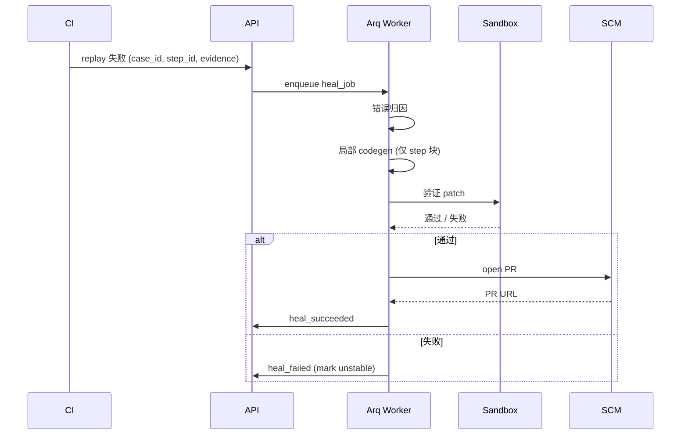

# OpenGUIRobot · v0.4 技术文档

> 配合 [`PRD.md`](./PRD.md)。架构总览见 [`ARCHITECTURE.md`](../../../ARCHITECTURE.md)。

---

## 1. 技术目标

- 把 Heal Mode 真正做"闭环"：失败 → 局部 patch → 自动 PR
- 上线 Web Dashboard，让团队从命令行走向看板
- 引入多租户 + RBAC，从"内部工具"升级到"平台产品"
- 把可观测性做到企业可审计标准

---

## 2. 模块清单与工作分解

| 模块 | 包 | 工作 | 估时 |
|---|---|---|---|
| Heal 引擎 | `openguirobot.orchestrator.heal` | 错误归因 + 局部 codegen + sandbox 验证 | 6 |
| PR 适配器 | `openguirobot.integrations.scm` | GitHub / GitLab / Gitee API | 4 |
| FastAPI 路由 | `openguirobot.api` | 设备 / 任务 / case / KB / cost / tenant | 6 |
| Auth | `openguirobot.auth` | JWT + OAuth2（多 provider） | 4 |
| Tenant / RBAC | `openguirobot.tenant` | 数据模型 + 中间件 | 4 |
| Quota | `openguirobot.quota` | 配额 + 限流 + 告警 | 3 |
| WebSocket | `openguirobot.api.ws` | 任务实时推送 | 2 |
| OpenAPI Sync | `tools/gen-api-types` | swagger-typescript-api 集成 | 1 |
| Dashboard 框架 | `web/` Umi 4 配置 | layout + access + 主题 | 3 |
| Dashboard 首页 | `web/src/pages/Dashboard` | ProCard + ECharts | 2 |
| Devices 页 | `web/src/pages/Devices` | ProTable + 远程操作 | 3 |
| Jobs 页 | `web/src/pages/Jobs` | ProTable + 详情抽屉 + WebSocket | 4 |
| Cases 页 | `web/src/pages/Cases` | ProForm + 触发 | 3 |
| Knowledge 页 | `web/src/pages/Knowledge` | 树 + react-markdown | 3 |
| Graph 页 | `web/src/pages/Graph` | AntV G6 + 置信度 | 4 |
| Cost 页 | `web/src/pages/Cost` | ECharts | 2 |
| 部署模板 | `deploy/` | docker-compose + Helm | 4 |
| OTel | `openguirobot.obs.tracing` | instrument + exporter | 3 |
| 私有化文档 | `docs/PRIVATE-DEPLOY.md` | 离线包 + 内网证书 | 2 |

合计：约 63 人天。

---

## 3. 关键技术决策

### 3.1 Heal 仅改"失败步骤所在的代码块"

每个固化代码用注释划分代码块：

```python
# === step-007: 点击搜索按钮 ===
s.tap(locate("搜索入口"))
# === /step-007 ===
```

Heal 只允许修改 `=== step-NNN ===` 块内代码，不许改外部。

### 3.2 PR 通过 SCM 适配器统一抽象

```python
class SCMProvider(Protocol):
    def open_pr(self, repo: str, branch: str, title: str, body: str,
                base: str = "main") -> PRRef: ...
    def comment(self, pr: PRRef, body: str) -> None: ...

class GitHubProvider(SCMProvider): ...
class GitLabProvider(SCMProvider): ...
class GiteeProvider(SCMProvider): ...
```

### 3.3 Dashboard 不直接读 DB

所有数据走后端 OpenAPI，前端通过 `swagger-typescript-api` 生成的 `services/api.ts` 调用：

```bash
pnpm gen:api    # 从 http://localhost:8000/openapi.json 生成 TS 客户端
```

### 3.4 多租户走"行级 + 应用层"双隔离

- DB 层：用 PostgreSQL Row Security Policy（RLS），每个查询自动加 tenant_id 过滤
- App 层：FastAPI 中间件解析 JWT 拿 tenant_id，注入查询 context
- 双层一致性测试是 P0

### 3.5 OTel 默认 OTLP，不绑定具体后端

`OTEL_EXPORTER_OTLP_ENDPOINT` 一个变量切换 Tempo / Datadog / 阿里云 ARMS / Honeycomb。

### 3.6 Helm chart 设计为"组件可裁剪"

```yaml
# values.yaml
postgres:
  enabled: true              # 自带 or 外部
qdrant:
  enabled: true
redis:
  enabled: true
local_vllm:
  enabled: false             # 私有化时才开
oauth:
  github: { enabled: false }
```

---

## 4. 接口与数据模型

### 4.1 Heal 任务流



### 4.2 Tenant 数据模型

```sql
CREATE TABLE tenants (
    id          BIGSERIAL PRIMARY KEY,
    slug        TEXT UNIQUE NOT NULL,
    name        TEXT NOT NULL,
    quota       JSONB NOT NULL DEFAULT '{}'::jsonb,
    created_at  TIMESTAMPTZ DEFAULT now()
);

ALTER TABLE devices ADD COLUMN tenant_id BIGINT NOT NULL REFERENCES tenants(id);
ALTER TABLE jobs    ADD COLUMN tenant_id BIGINT NOT NULL REFERENCES tenants(id);
ALTER TABLE cases   ADD COLUMN tenant_id BIGINT NOT NULL REFERENCES tenants(id);
-- ... 其它业务表同样

ALTER TABLE devices ENABLE ROW LEVEL SECURITY;
CREATE POLICY tenant_isolation ON devices
  USING (tenant_id = current_setting('app.tenant_id')::bigint);
```

### 4.3 RBAC 模型

```python
class Permission(str, Enum):
    DEVICE_VIEW   = "device.view"
    DEVICE_MANAGE = "device.manage"
    CASE_RUN      = "case.run"
    CASE_EDIT     = "case.edit"
    KB_READ       = "kb.read"
    KB_WRITE      = "kb.write"
    COST_VIEW     = "cost.view"
    TENANT_ADMIN  = "tenant.admin"

DEFAULT_ROLES = {
    "owner":    {p for p in Permission},
    "admin":    {Permission.DEVICE_MANAGE, Permission.CASE_EDIT, Permission.KB_WRITE, ...},
    "engineer": {Permission.CASE_RUN, Permission.CASE_EDIT, Permission.KB_READ, ...},
    "viewer":   {Permission.DEVICE_VIEW, Permission.CASE_RUN, Permission.KB_READ},
}
```

### 4.4 前端 Umi `access.ts`

```typescript
export default function access(initialState: { user?: User }) {
  const perms = new Set(initialState?.user?.permissions ?? []);
  return {
    canManageDevice: () => perms.has('device.manage'),
    canEditCase:     () => perms.has('case.edit'),
    canViewCost:     () => perms.has('cost.view'),
  };
}
```

### 4.5 OAuth provider 接入

```yaml
auth:
  default: jwt
  oauth:
    github:
      client_id: ...
      client_secret_env: GH_OAUTH_SECRET
      callback_url: https://ogr.example.com/auth/github/callback
    feishu:
      app_id: ...
      app_secret_env: FEISHU_APP_SECRET
```

### 4.6 OTel 自定义 span 属性

每个 trace 至少携带：

```
ogr.tenant_id
ogr.case_id
ogr.mode (explore|heal|replay)
ogr.device_id
ogr.platform
ogr.llm.model
ogr.llm.tokens_in / out
ogr.cost_usd
```

---

## 5. 部署形态

### 5.1 单机 docker-compose

```yaml
# deploy/compose/docker-compose.yaml
services:
  postgres:    { image: postgres:14, ... }
  redis:       { image: redis:7 }
  qdrant:      { image: qdrant/qdrant }
  registry:    { image: openguirobot/api, ... }
  arq-worker:  { image: openguirobot/api, command: arq openguirobot.jobs.worker.WorkerSettings }
  scheduler:   { image: openguirobot/api, command: ogr scheduler }
  web:         { image: openguirobot/web, ... }
```

### 5.2 K8s Helm chart

```
deploy/k8s/openguirobot/
├── Chart.yaml
├── values.yaml
└── templates/
    ├── api-deploy.yaml
    ├── api-service.yaml
    ├── web-deploy.yaml
    ├── arq-worker.yaml
    ├── scheduler-cronjob.yaml      # Helm 内 Job/CronJob
    ├── postgres-statefulset.yaml
    ├── qdrant-statefulset.yaml
    ├── redis.yaml
    ├── ingress.yaml
    └── otel-collector.yaml         # 可选
```

### 5.3 私有化离线包

`deploy/private/` 包含：

- `images/`：所有 Docker 镜像 tar 包
- `models/`：Qwen2.5-VL-7B 权重 + BGE-M3 权重
- `helm/`：本地化 values + 内网域名
- `INSTALL.md`：步步教学

---

## 6. 测试策略

| 类型 | 范围 |
|---|---|
| 单测 | Heal 归因 / PR diff / Tenant 中间件 |
| 集成 | 起 compose 全栈，跑 e2e demo |
| Dashboard 端到端 | Playwright 跑 7 个页面 |
| Heal 黄金集 | 50 个故意失败 case，自动 PR 通过率 ≥ 50% |
| 多租户隔离 | 跨 tenant 读写测试，必须 0 泄漏 |
| 安全 | OWASP ZAP；沙箱 fuzzer 10 万样本 |
| 私有化演练 | 在断网 VM 中按文档复装一遍 |

---

## 7. 风险与缓解

| 风险 | 缓解 |
|---|---|
| Heal PR 改了业务逻辑 | 仅改 step 块 + 必须人工 review；超出范围立刻 reject |
| Dashboard 工程量爆炸 | P0 = 7 个页面骨架；P1 = 高级可视化挪到 v1.0 |
| 多租户隔离漏洞 | 双层校验 + 每 PR 自动渗透测试 |
| OAuth 流程难调试 | 提供 mock provider 用于本地开发 |
| OTel 数据爆炸 | 默认 trace sample 10%，cost / metric 不采样 |

---

## 8. 工作分解结构（WBS）

```
W1  Heal 引擎 + PR 适配器
    ├─ 错误归因（定位 / 断言 / 异常）
    ├─ 局部 codegen + step-block 限定
    ├─ sandbox 验证 patch
    └─ GitHub / GitLab / Gitee 适配器

W2  后端 API + OpenAPI
    ├─ FastAPI 路由整理（device / job / case / kb / graph / cost / tenant / auth）
    ├─ pydantic schemas
    ├─ swagger-typescript-api 集成
    └─ WebSocket 任务实时推送

W3  Dashboard 框架 + 3 页
    ├─ Umi 4 + Ant Design Pro 5 配置
    ├─ Layout + Access + 主题
    ├─ 首页 / Devices / Jobs

W4  Dashboard 剩余 4 页
    ├─ Cases / Knowledge
    ├─ Graph (AntV G6)
    └─ Cost (ECharts)

W5  多租户 / RBAC / SSO
    ├─ Tenant 模型 + RLS policy
    ├─ RBAC 中间件 + 前端 access
    ├─ JWT + OAuth2（GitHub / 飞书 / 企业微信）
    └─ Quota + 限流

W6  部署 / OTel / 验收
    ├─ docker-compose + Helm chart
    ├─ OTel 自动 + 业务 instrument
    ├─ 私有化文档 + 离线包脚本
    └─ 三个试点客户接入
```

---

## 9. 留给 v1.0 的开放问题

- 文档不够完整，缺贡献者指南、企业部署最佳实践
- 国产 LLM 适配深度不够（DashScope / 通义 / 豆包 / 智谱 / Kimi 全 chain）
- 没有第三方安全审计报告
- 缺 LTS 分支策略与发布流程
