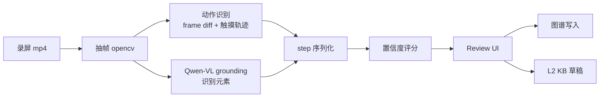

# OpenGUIRobot · v1.x 技术文档（路线图层）

> 配合 [`PRD.md`](./PRD.md)。架构总览见 [`ARCHITECTURE.md`](../../../ARCHITECTURE.md)。
> 本文件给出每个 v1.x 子特性的**技术骨架**与"和现有架构怎么对接"。具体实现细节在每个子版本进入实施时单独展开。

---

## 1. 技术目标

- 在不破坏开源主干的前提下，落地四块差异化能力
- 用插件机制 / 适配层 / 子模块的方式，把每个特性做成"开关式"
- 商业版与开源版同代码仓，通过 license 分发差异

---

## 2. v1.1 业务地图插件（L6）技术骨架

### 2.1 包与模块

```
openguirobot/plugins/business_map/
├── __init__.py
├── schema.py             # 模板 pydantic + jsonschema
├── store.py              # 模板存储（DB + 向量索引）
├── matcher.py            # 向量 + 关键词混合匹配
├── plan.py               # 模板 → Plan 展开（zero-token）
├── react.py              # ReAct 执行（仅细节调 LLM）
├── version.py            # 模板版本与灰度
└── editor_api.py         # Dashboard 编辑器接口
```

### 2.2 与现有架构对接

```
TestCase intent
   │
   ▼
┌──────────────────────────────┐
│  Template Matcher (新增 v1.1) │
└──────────────────────────────┘
   │             │
   ▼             ▼
hit (≥ θ)   miss / low-confidence
   │             │
   ▼             ▼
Plan (zero-LLM)  Code-as-Action（默认路径）
   │
   ▼
ReAct executor (复用现 Skill 层)
```

### 2.3 模板 schema（节选）

```python
class TemplateStep(BaseModel):
    intent: str
    locator_query: str
    expected: str
    optional: bool = False

class BusinessTemplate(BaseModel):
    template_id: str
    title: str
    aliases: list[str]                  # 用于关键词匹配
    parameters: list[ParameterSpec]     # 参数槽
    steps: list[TemplateStep]
    platform_overrides: dict[str, list[TemplateStep]] = {}
    confidence_threshold: float = 0.6
    version: str
    deprecated: bool = False
```

### 2.4 关键技术决策

- **模板 store 与图谱共用 KuzuDB**：模板就是一种"被人为认证过的高置信度 Path"
- **匹配器**：Qdrant 向量 top-K（基于 title + aliases + 历史 hit 文本）→ Kuzu 图遍历验证 → rerank
- **灰度**：模板版本以 traffic shaping 灰度（v1 90% / v2 10%）

### 2.5 测试

- 5 个业务领域（电商 / 本地生活 / 社交 / IM / 视频）各 20 模板，回归一致性
- 模板路径与 Code-as-Action 路径在同一 case 上的成本对比基线

---

## 3. v1.2 视频 → 操作图谱抽取技术骨架

### 3.1 Pipeline



### 3.2 包与模块

```
openguirobot/extractors/video/
├── frame_split.py       # 抽帧（按动作密度自适应间隔）
├── action_detect.py     # 帧差 + OCR + grounding 识别 tap / swipe / type
├── element_locate.py    # Qwen-VL grounding 精定位
├── confidence.py        # 综合打分
├── reviewer_api.py      # Dashboard review UI 接口
└── pipeline.py          # 整体编排
```

### 3.3 关键技术决策

- **不直接落库**，强制走 review。这是质量底线
- **置信度 ≥ 0.8 默认勾选**；< 0.5 默认禁选
- **抽帧策略**：先粗（每秒 2 帧）找疑似动作时刻，疑似时刻附近精抽（10 fps）
- **动作识别**：Android 可借 `getevent` 流；无源时仅靠帧差 + grounding 推断
- **可逆性**：每个图谱节点存录屏 URL + 时间戳；review UI 可回看

### 3.4 与 v1.1 衔接

抽取得到的 Path 自动产出"模板候选"：在 Dashboard 中可一键升级为业务模板。

### 3.5 测试

- 100 段真实录屏（10 个 App，每个 10 段）
- 准确率：节点级 ≥ 80%、动作级 ≥ 75%
- review 工时 ≤ 录屏时长 30%

---

## 4. v1.3 IDE 插件技术骨架

### 4.1 架构

```
┌──────────────┐                  ┌──────────────┐
│  VSCode Ext  │ ───┐         ┌── │ JetBrains Ext│
│  TypeScript  │    │         │   │  Kotlin      │
└──────────────┘    │         │   └──────────────┘
                    ▼         ▼
              ┌─────────────────────┐
              │  IDE Plugin Core    │
              │  (TypeScript shared)│
              └─────────────────────┘
                       │
              ┌────────▼─────────┐
              │  OGR HTTP API    │
              │  (本地 / 集群)   │
              └──────────────────┘
```

### 4.2 共享核心

把 IDE 无关的逻辑抽到 `ide-plugin-core`（TypeScript NPM 包）：

- API 客户端（基于 swagger-typescript-api 生成）
- WebSocket 流式订阅
- LLM 补全协议
- 命令注册（explore / heal / replay / open evidence）

VSCode 直接调；JetBrains 通过 Node sidecar 调（或用 Kotlin 重写一遍 API 客户端）。

### 4.3 关键技术决策

- **设备屏幕实时流**：通过 WebSocket 推 PNG（不上 H.264，避免依赖）；30 fps 太高，**默认 5 fps**
- **LLM 补全**：仅在用户 explicit 触发（按键），不做自动建议（避免成本失控）
- **evidence 跳转**：直接打开本地 / 远程 evidence 文件，依赖 IDE 自身的 Markdown / image 预览

### 4.4 测试

- VSCode 与 JetBrains 共享 e2e 测试集（用 Playwright + JetBrains UI test）
- 5 名工程师试用 1 周，记录使用频次与卡点

---

## 5. v1.x.E 商业版差异化技术骨架

### 5.1 代码组织

同代码仓，目录区分：

```
openguirobot/
├── ...                  # 开源核心
└── ee/                  # Enterprise Edition（仅商业 license 启用）
    ├── auth_saml/
    ├── auth_scim/
    ├── audit_log/
    ├── multi_cluster/
    ├── advanced_dashboard/
    └── compliance/
```

构建时通过 feature flag + license 校验决定是否加载。

### 5.2 License 校验

- 启动时验证 license 文件签名（公钥内置）
- 过期 / 无效 license → ee 模块不加载，回退到开源功能集
- 不做"反盗版"侵入式手段；本质是商业道德 + 合规约束

### 5.3 关键模块

| 模块 | 用途 | 依赖 |
|---|---|---|
| `ee.auth_saml` | SAML 2.0 IdP 集成 | python-saml |
| `ee.auth_scim` | SCIM 用户同步 | scim2-* |
| `ee.audit_log` | 全量审计 + 不可篡改（hash chain） | sqlalchemy + cryptography |
| `ee.multi_cluster` | 跨地域联邦调度 | grpc |
| `ee.advanced_dashboard` | 自定义看板 + 定时邮件 | celery？不，用 APScheduler + 邮件服务 |
| `ee.compliance` | GDPR / 等保导出 | … |

### 5.4 数据合规导出

- 用户数据：按 tenant 拉所有相关数据 → 加密压缩 → S3 链接（24h 过期）
- 用户删除：DELETE 走"软删 → 30 天后真删"，期间可恢复

### 5.5 SLA 工程化

- 工单系统（Zendesk / 飞书 / 内部）API 集成
- 严重事件自动呼叫值班（PagerDuty）
- 监控：定义 SLO（99.9% 调度可用、4h MTTR）

---

## 6. 跨子特性的技术约束

- 所有 v1.x 特性必须在**关闭时**与开源版行为一致
- 所有 v1.x 特性必须在 v1.0 LTS 上能"按需启用"，不要求升级 minor
- 所有 v1.x 特性的 schema 变更必须 backward-compatible

---

## 7. 风险与缓解

| 风险 | 缓解 |
|---|---|
| v1.1 模板与 Code-as-Action 互相干扰 | 严格的命中阈值；模板路径 explicit 标记 |
| v1.2 抽取错误污染图谱 | 强制 review；置信度阈值；可一键回滚 |
| v1.3 IDE 插件长期维护成本 | core 共享 NPM 包；放慢功能迭代节奏 |
| v1.x.E 与开源边界争议 | 公开 charter；核心能力永远开源；商业版仅围绕运营/合规/服务 |
| 多 minor 同时排期 | 每个 minor 独立 release branch；不强制同步 |

---

## 8. 子版本进入实施时的拆分

到具体季度开工时，把以下文件展开：

- `docs/roadmap/v1.1/PRD.md` + `TECH-SPEC.md`（业务地图）
- `docs/roadmap/v1.2/PRD.md` + `TECH-SPEC.md`（视频抽取）
- `docs/roadmap/v1.3/PRD.md` + `TECH-SPEC.md`（IDE 插件）
- `docs/roadmap/v1.x-enterprise/PRD.md` + `TECH-SPEC.md`（商业版）
